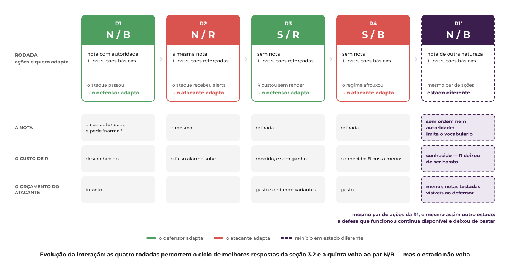

# Análise de um Sistema Adversarial

### Um atacante manipula o que o detector lê para não ser alertado; o defensor observa os erros e endurece o contexto; os dois se adaptam rodada a rodada

## 1. Proposta

Um atacante simulado modifica o texto apresentado ao Jev para tentar evitar a detecção; o defensor observa os erros e revisa as instruções. Ambos adaptam suas escolhas a partir das respostas que podem observar.

O trabalho analisa uma interação específica: a classificação de um registro de conexão pelo Jev IDS, utilizando dados do NSL-KDD. O atacante busca fazer registros maliciosos serem classificados como normais, inserindo notas enganosas em um campo do registro. O defensor procura reconhecer esses ataques sem aumentar excessivamente os falsos alarmes sobre tráfego legítimo.

Para delimitar o estudo, o atacante poderá alterar somente a nota textual e observar se suas próprias tentativas geraram alerta. O defensor poderá revisar somente as instruções que orientam o Jev. Os exemplos de referência e as demais configurações permanecerão fixos, permitindo comparar os efeitos dessas escolhas.

O projeto **Jev IDS** será a base conceitual e experimental. Por questões de custo, adotaremos duas alternativas de execução local ao modelo Jev: **Qwen3:8b, por meio do Ollama**, e **Laya multilingual**. Cada modelo será considerado separadamente na mesma função de detector.

A pergunta central será:

> **Como a revisão das instruções pelo defensor influencia a detecção quando o atacante adapta suas notas a partir dos resultados observados, e como essa interação se manifesta no Qwen e no Laya?**

Esta proposta apresenta a ideia, os participantes e o recorte da análise. O foco será compreender o conflito de interesses e o ciclo de adaptação entre atacante e defensor.

## 2. Sistema e interação analisada

### Projeto de referência e escolha das tecnologias

O sistema escolhido é o Jev IDS, apresentado no projeto [Jev-ids-adversarial](https://github.com/Tucelos/Jev-ids-adversarial). Ele utiliza o Jev para classificar registros de conexões de rede e permite investigar como mudanças no contexto apresentado ao detector influenciam suas decisões.

O Jev é um modelo de inteligência artificial da TypeSafe, descrito como um System One Model. Ele recebe informações e perguntas com formatos de resposta definidos, retornando decisões estruturadas, como a escolha de uma categoria ou uma probabilidade. Essas respostas podem ser utilizadas diretamente por um programa. [Documentação oficial do Jev](https://docs.typesafe.ai/introduction).

No Jev IDS, cada avaliação reúne um registro de conexão, instruções sobre a tarefa e exemplos rotulados de referência. O Jev responde a duas perguntas: se a conexão representa um ataque e a qual categoria ela pertence. A probabilidade de ataque, denominada `p_attack`, é utilizada para produzir o veredito: valores iguais ou superiores a 0,5 geram alerta.

O acesso ao Jev ocorre por API, com cobrança por consumo de tokens de entrada. Para viabilizar a exploração de diferentes contextos sem despesas com essa API, optamos pelos modelos locais descritos a seguir.

| Tecnologia | O que é | Papel na proposta |
|---|---|---|
| **Qwen3:8b** | Modelo de linguagem da família Qwen, com cerca de oito bilhões de parâmetros, capaz de interpretar instruções e gerar respostas textuais. | Será solicitado a classificar cada registro e responder em formato estruturado. Será utilizado com o modo *thinking* desativado. [Documentação do Qwen](https://huggingface.co/Qwen/Qwen3-8B). |
| **Ollama** | Software que permite executar modelos de IA no computador e acessá-los por uma interface de programação. | Executará o Qwen localmente e fará a comunicação entre ele e o projeto. O modelo avaliado será o Qwen; Ollama será o ambiente de execução. [Documentação do Ollama](https://docs.ollama.com/). |
| **Laya multilingual** | Modelo de decisão da Convai Innovations, com pesos abertos, voltado a responder perguntas estruturadas sobre informações fornecidas. Integra a família Laya, apresentada como uma abordagem *System 1*. | Será a segunda alternativa de classificador local, retornando probabilidades e categorias em um formato compatível com a integração do Jev. [Documentação do Laya](https://huggingface.co/convaiinnovations/laya). |

Essa escolha permite utilizar os recursos computacionais disponíveis ao grupo, sem cobrança de um provedor por cada inferência local. Permanecem os custos de processamento, memória e energia. O Jev IDS continuará sendo a referência do trabalho, enquanto as decisões analisadas serão produzidas pelo Qwen e pelo Laya, modelos distintos do Jev.

O estudo utiliza o NSL-KDD, um conjunto de dados com registros de conexões descritos por 41 atributos, como protocolo, serviço, duração e quantidade de bytes. A categoria verdadeira de cada registro avaliado fica reservada à verificação dos resultados e não é apresentada ao detector.

### O que significa alterar o contexto

Contexto é a informação que orienta a interpretação do registro, incluindo instruções, descrições dos atributos e das categorias, exemplos de referência e a apresentação dos dados. Alterar essas informações pode mudar a decisão do Jev sem retreinar o modelo.

Neste trabalho, serão exploradas duas alterações: o atacante poderá inserir uma nota enganosa no campo `service`, enquanto o defensor poderá revisar as instruções da tarefa. Os demais elementos permanecerão fixos. O risco investigado é que uma mensagem inserida como dado seja interpretada pelo detector como uma orientação confiável.

A interação ocorrerá em uma simulação com registros do dataset, sem envio de ataques a uma rede real. O atacante receberá apenas o veredito de suas próprias tentativas; o defensor receberá os resultados autorizados da avaliação para orientar suas revisões. A análise buscará compreender como essas escolhas afetam a detecção de ataques e os falsos alarmes sobre registros legítimos.

## 3. Desenvolvimento

A análise considera dois participantes estratégicos: um atacante simulado e um defensor. O atacante modifica notas inseridas nos registros para tentar evitar alertas; o defensor revisa as instruções para melhorar a detecção sem aumentar excessivamente os falsos alarmes. O Jev realiza a classificação, enquanto o ambiente experimental organiza as avaliações e controla as informações entregues a cada participante.

## 3.1 Descrição do sistema adversarial

### Atores

| Ator | Objetivo | Ações ou capacidades | Informações observáveis | Restrições ou custos |
|---|---|---|---|---|
| Atacante simulado | Fazer registros maliciosos receberem o veredito sem alerta. | Escolher, manter, retirar ou reformular uma nota textual inserida no campo `service`. | Suas próprias notas e os vereditos das próprias tentativas: alerta ou sem alerta. | Não acessa as instruções do defensor, os exemplos, o gabarito ou as métricas de avaliação. Não altera outros atributos. Está sujeito a limites de tentativas e de tamanho da nota. |
| Defensor | Detectar registros maliciosos e limitar os falsos alarmes sobre tráfego legítimo. | Escolher, manter ou revisar as instruções apresentadas ao Jev. | Suas instruções, as notas testadas e os resultados autorizados da avaliação, incluindo ataques detectados, ataques não detectados, falsos alarmes e erros de processamento. | Não altera registros, exemplos, modelo ou limiar de alerta. Está sujeito a limites de revisões, tamanho do texto e chamadas ao detector. Não utiliza os dados reservados à avaliação final para adaptar suas escolhas. |

O retorno dos vereditos ao atacante é uma condição definida pela simulação. O defensor identifica acertos e erros com apoio do avaliador, que compara as respostas com o gabarito mantido separadamente da entrada do Jev.

Os registros normais representam os interesses dos usuários legítimos, mas estes não constituem um terceiro jogador neste recorte. Jev, coordenador e avaliador são componentes do ambiente experimental, não participantes estratégicos.

### Ativos preservados

AT1: integridade da classificação e detecção de ataques; AT2: integridade dos exemplos e instruções; AT3: disponibilidade e confiabilidade do processamento; AT4: qualidade das decisões sobre registros legítimos.

### Pressupostos

- **S1 — Separação entre dados e instruções:** valores do registro são dados, sem autoridade para modificar a tarefa. Falha quando uma nota em `service` é seguida como instrução.
- **S2 — Integridade dos exemplos:** os rótulos de referência são corretos. Falha quando um insider ou origem comprometida os adultera.
- **S3 — Integridade das instruções:** as orientações carregadas têm origem autorizada e permanecem íntegras. Falha quando alguém com acesso à configuração insere instruções enganosas.
- **S4 — Confiabilidade do resultado:** classificar como normal pressupõe uma resposta válida. Falha quando ausência de resposta é contabilizada como normal. Na base inspecionada, ausência de `p_attack` produz veredito `None`, considerado normal na avaliação.

S2 e S3 fundamentam cenários ampliados com acesso adicional, fora das capacidades do atacante principal. S4 não pressupõe que esse atacante consiga provocar falhas.

### Diagrama de contexto

O coordenador, a separação de observações e os agentes adaptativos são componentes propostos para a simulação. O diagrama não representa uma implantação em rede real.

### Por que é adversarial

Há objetivos conflitantes: o atacante pretende evitar alertas sobre registros maliciosos; o defensor pretende detectá-los preservando decisões úteis sobre registros legítimos. Cada participante pode adaptar sua ação a partir de observações autorizadas. Assim, o estudo analisa uma interação estratégica, não somente uma busca pelo contexto com maior F1.

## 3.2 Modelo estratégico estático

### Ações e utilidades

O atacante escolhe **N**, inserir uma nota enganosa, ou **S**, submeter o registro malicioso sem nota. O defensor escolhe **B**, manter instruções básicas, ou **R**, usar instruções reforçadas que explicitam a separação entre dados e instruções. Ambas as ações defensivas respeitam o recorte: não alteram exemplos, modelo ou limiar.

A matriz é uma hipótese estratégica para discussão do grupo. Os valores 0–3 representam somente ordens de preferência, não resultados medidos. Cada par segue a ordem **(atacante, defensor)**. O símbolo ★A indica uma melhor resposta do atacante; ★D, do defensor.

### Matriz 2×2

| Atacante / Defensor | B — instruções básicas | R — instruções reforçadas |
|---|---|---|
| N — ataque com nota | (3, 0) ★A | (0, 2) ★D |
| S — ataque sem nota | (1, 3) ★D | (1, 1) ★A |

### Justificativa dos payoffs

- **N/B:** supõe-se que a nota consiga favorecer evasão; é o resultado preferido do atacante e o pior do defensor.
- **N/R:** supõe-se que o reforço neutralize a influência da nota; o atacante perde o benefício da injeção e paga seu custo de preparação. O defensor detecta, mas arca com instruções mais extensas e possíveis efeitos colaterais.
- **S/B:** o atacante conserva a possibilidade de evasão inerente ao detector, porém sem o ganho hipotético da nota. O defensor obtém a situação preferida: não enfrenta a nota e mantém menor custo de instruções.
- **S/R:** o atacante não paga o custo da nota, conservando a mesma preferência atribuída ao ataque sem nota. O defensor paga um reforço desnecessário para essa ameaça específica, sem benefício assumido nessa célula.

Essas preferências dependem das hipóteses de eficácia e custo. Uma revisão das instruções pode ajudar também contra ataques sem nota; se isso ocorrer, a matriz deve ser revista. O menor payoff defensivo em S/R representa custo de processamento e eventual prejuízo a decisões legítimas, não uma medida observada.

### Melhores respostas e equilíbrio

Contra B, o atacante prefere N (3 > 1); contra R, prefere S (1 > 0). Contra N, o defensor prefere R (2 > 0); contra S, prefere B (3 > 1). Portanto, nenhum jogador tem estratégia dominante e nenhuma célula constitui equilíbrio de Nash em estratégias puras.

O ciclo de melhores respostas é N/B → N/R → S/R → S/B → N/B. O jogo finito admite equilíbrio misto sob uma representação apropriada de utilidades, mas não calculamos suas probabilidades: uma escala somente ordinal não justifica usar suas distâncias como utilidades cardinais. O cálculo misto é um aprofundamento opcional.

A ausência de equilíbrio puro motiva examinar adaptações sucessivas. Ela não prova que o sistema real percorrerá esse ciclo. Para os usuários legítimos, o resultado desejável envolve detecção com poucos falsos alarmes e custo aceitável; o payoff do defensor incorpora esses interesses.

## 3.3 Modelo estratégico dinâmico

A matriz da seção anterior descreve uma decisão isolada. Nesta seção a mesma disputa é observada ao longo do tempo, porque **o veredito é informação para os dois lados**: o atacante o recebe sobre as próprias tentativas, e o defensor o recebe agregado pelo avaliador. Cada rodada segue o ciclo `ação → resposta → observação → adaptação`, e a observação de uma rodada é o que causa a adaptação da seguinte.

A sequência percorre o ciclo de melhores respostas identificado na seção 3.2 — `N/B → N/R → S/R → S/B` — e mostra o que a matriz 2×2 não consegue mostrar: as quatro células permanecem, mas **o conteúdo de cada uma muda a cada volta**.

### Rodadas propostas

As rodadas abaixo são um cenário de planejamento, não um histórico de execuções. Uma transição ocorre somente se as observações previstas aparecerem. Cada modelo deve ser avaliado separadamente.

| Rodada | Ação do atacante | Resposta do defensor | Observação autorizada | Adaptação seguinte |
|---|---|---|---|---|
| **R1 — N/B** | Submete o registro malicioso com uma nota em `service` que alega manutenção autorizada e pede a classificação normal. | Mantém as instruções básicas. | **Atacante:** os registros com nota recebem "sem alerta". **Defensor:** o avaliador reporta evasões no conjunto de desenvolvimento e as notas correspondentes. | O defensor passa a **R**: instruções que declaram que valores do registro, inclusive `service`, são dados não confiáveis e não alteram a tarefa. |
| **R2 — N/R** | Mantém a mesma nota, para sondar o novo comportamento. | Aplica as instruções reforçadas. | **Atacante:** a nota que passava agora recebe alerta. Ele percebe *que* algo mudou, não *o quê*. **Defensor:** a evasão por nota cai, mas sobem os falsos alarmes sobre registros legítimos cujo `service` é raro — o reforço ensina o detector a desconfiar do campo, e não apenas da nota. | **Atacante:** a nota virou passivo; retira-a, passando a **S**. **Defensor:** passa a contabilizar o custo de **R** em falso alarme. |
| **R3 — S/R** | Submete o ataque sem nota. Em paralelo, gasta parte do orçamento sondando variantes da nota, para descobrir qual parte dela era punida. | Mantém **R** enquanto mede seu custo. | **Atacante:** sem a nota volta a passar na taxa de base do detector, o que indica que o punido era a nota. **Defensor:** **R** não traz ganho contra **S** e segue cobrando falso alarme de quem não participa da disputa. Ele também **vê as notas sondadas**, porque notas testadas estão entre suas observações autorizadas. | **Defensor:** volta a **B**, decisão correta pelo custo medido e arriscada diante da sondagem que ele acabou de observar. **Atacante:** conclui a sondagem. |
| **R4 — S/B** | Mantém o ataque sem nota enquanto encerra a sondagem. | Retorna às instruções básicas. | **Atacante:** registros que recebiam alerta na R3 voltam a passar, sinal de que o regime afrouxou. A sondagem indica que a punição recaía sobre a *alegação de autoridade*, não sobre a presença de texto. **Defensor:** sem a nota, **B** e **R** se equivalem em detecção, e **B** custa menos. | O atacante volta a **N**, com uma nota de outra natureza: sem ordem e sem alegação de autoridade, apenas um qualificador de serviço plausível dentro do vocabulário do dataset. |

Fonte editável: [quadro no Figma](https://www.figma.com/design/pioW9qAOO7tnPXLljz2aNk?node-id=61-2).

Os cartões de cima são a tabela acima em forma visual; as três faixas de baixo são o que separa a **R1'** da **R1**. O par de ações volta a ser o mesmo, e a nota, o custo já conhecido de **R** e o orçamento do atacante não voltam.

### Por que o ciclo não retorna ao ponto de partida

A R4 devolve o par de ações ao estado da R1, mas **o estado da disputa é outro**, por três razões:

1. **A nota mudou de natureza.** A nota da R1 tentava *alterar a tarefa*; a nota que abre a volta seguinte tenta *alterar a evidência*. O reforço **R**, redigido para negar autoridade a valores do registro, não cobre uma nota que não dá ordem alguma. A defesa que funcionou continua disponível e deixou de ser suficiente.
2. **O defensor passou a conhecer o preço de R.** Na R1 ele podia adotar o reforço sem saber quanto custava; depois da R2 e da R3 ele sabe que custa falso alarme sobre `service` raro. A mesma ação, com o mesmo rótulo, deixou de ser barata.
3. **O orçamento do atacante diminuiu.** As tentativas de sondagem da R3 e da R4 não voltam, e cada uma delas revelou ao defensor uma nota testada.

Em outras palavras: os rótulos das células se repetem, mas o conteúdo de cada uma é diferente a cada volta. É esse deslocamento, e não o ciclo em si, que caracteriza a adaptação.

### O que cada rodada demonstra

- **A resposta também produz informação.** Nas R1 e R2 o atacante nunca vê `p_attack` nem as instruções; ele infere pelo efeito. O "sem alerta" da R1 e o alerta da R2 são, cada um, uma consulta barata ao detector.
- **Mesmo objetivo, ação diferente.** O objetivo é o mesmo nas quatro rodadas — fazer um registro malicioso receber o veredito sem alerta. O que muda é a nota.
- **O defensor também observa e adapta.** Nas R1 e R3 quem muda de ação é ele; na R2 ele mantém o reforço e passa a medir o que ele custa. A adaptação dele vem sempre de uma observação agregada do avaliador, não de um registro isolado.
- **Decisões passadas alteram as possibilidades.** Pelas três razões da subseção anterior: a nota muda de natureza, o custo de **R** deixa de ser desconhecido e o orçamento encolhe.
- **A defesa cobra de quem não está na disputa.** Nas R2 e R3 o reforço aumenta o falso alarme sobre registros legítimos de serviço raro. Esse custo recai sobre o ativo **AT4** e sobre usuários que não participam da interação, e na R3 ele é pago sem benefício, porque o atacante já havia retirado a nota.

### Diagrama do ciclo adaptativo

Fonte editável: [quadro no Figma](https://www.figma.com/design/pioW9qAOO7tnPXLljz2aNk?node-id=52-2), de onde o PNG é exportado. O arquivo `diagramas/ciclo-adaptativo.mmd` traz o mesmo ciclo em Mermaid, para quem preferir editar em texto.

O ramo no fim do ciclo é o que liga uma rodada à seguinte: **quem adapta depende de quem errou**. Se o ataque recebeu alerta, quem muda é o atacante; se o ataque passou, quem muda é o defensor. Os dois leem o mesmo veredito, em granularidades diferentes, e tiram dele conclusões opostas.

### Evidência preliminar e seus limites

As rodadas acima são um cenário de planejamento. Existem, porém, medições anteriores sobre a base do Jev IDS que indicam a **ordem de grandeza e a direção** de duas das alterações de contexto descritas. Elas foram produzidas em um estudo paralelo, **não são o experimento deste trabalho** e **não usaram Qwen nem Laya**: o detector foi o Nimble 9B, de pesos abertos, sobre o NSL-KDD no recorte `pilot` de 300 registros, com três sementes.

| Alteração medida | F1 | Relação com esta seção |
|---|---|---|
| Contexto de referência | 0,673 | linha de base da comparação |
| Texto injetado no campo do registro | 0,250 | **mesmo mecanismo da ação N** e do ponto P1 da seção 3.4: a nota anexada ao valor de `service`. McNemar p < 0,001. |
| Descrição das colunas enriquecida | 0,765 | **não é a ação R.** É outro fator de contexto, e serve apenas para mostrar que uma revisão de contexto pode mover o F1 em cerca de +0,09. McNemar p < 0,001. |

A primeira linha de ataque é a relevante: ela sustenta que o mecanismo da ação **N** pode derrubar a detecção de forma expressiva, e não que isso ocorrerá no Qwen ou no Laya com esta nota específica. Um modelo diferente pode reagir de outra maneira, e a medição do comportamento de cada um continua pendente.

Para o custo em falso alarme discutido nas R2 e R3 não há medição, mas há uma âncora da base: com o limiar em 0,5, a execução de referência do Jev produziu **43 falsos alarmes em 874 registros benignos**. É contra esse patamar que o custo do reforço precisa ser comparado quando for medido.

### Quem observa quem?

Os dois observam o mesmo veredito, em granularidades diferentes. O atacante observa **uma tentativa por vez**, com detalhe fino e resposta imediata; ele não tem acesso a F1, gabarito ou instruções. O defensor observa a **distribuição** — evasões, falsos alarmes, falhas e custo — com atraso, porque precisa de várias amostras para separar sinal de ruído, e somente sobre o conjunto de desenvolvimento: o conjunto final reservado não pode orientar adaptação.

A assimetria não é total. O defensor também recebe **as notas testadas**, de modo que a sondagem do atacante não é invisível, apenas chega depois. Isso favorece o atacante no curto prazo e o defensor no longo.

### O que cada lado consegue mudar?

O atacante muda apenas **a nota em `service`**: mantém, retira ou reformula, dentro de limites de tentativas e de tamanho. O defensor muda apenas **as instruções apresentadas ao detector**. Os demais atributos do registro, os exemplos, o modelo e o limiar de alerta permanecem fixos na sequência, conforme o recorte da seção 3.1.

Nenhum dos dois consegue mudar o que o outro muda, e nenhum dos dois controla o detector. É por isso que a disputa não se resolve pela ação de um só lado.

### O que dispara uma adaptação?

O mesmo evento, lido dos dois lados: o veredito. Para o atacante, o gatilho é **receber alerta** onde antes passava, ou voltar a passar onde antes recebia alerta. Para o defensor, é **uma evasão confirmada** na avaliação de desenvolvimento, ou o falso alarme ultrapassando o que ele considera aceitável. Os dois gatilhos aparecem na sequência: a evasão da R1 move o defensor, e o alerta da R2 move o atacante.

Nenhum participante recebe informação fora das capacidades declaradas na seção 3.1.

### Qual é o custo da adaptação?

Para o atacante, cada tentativa consome orçamento e **revela ao defensor a nota testada**; reformular a nota também custa trabalho. Para o defensor, instruções mais longas aumentam o texto de entrada, o processamento e a latência; além disso, validar uma revisão custa uma rodada inteira de avaliação, e o reforço cobra falso alarme sobre registros legítimos. Para o **usuário legítimo**, que não é jogador neste recorte, o custo é pago sem participação, nas R2 e R3.

Esses efeitos são hipóteses de planejamento e precisam ser medidos. Decisões anteriores consomem orçamento e condicionam as opções seguintes.

### Onde começa a corrida armamentista?

Não na R1–R2, que é apenas uma ação e sua resposta. Ela começa **na volta ao N**, ao fim da R4, quando o atacante retorna com uma nota de um tipo que a defesa existente não descreve. A partir daí, cada reformulação exige do defensor uma instrução mais específica, e cada instrução mais específica cobra mais falso alarme sobre registros legítimos.

A corrida não é limitada pela técnica, e sim por dois orçamentos: o de alarme falso que a operação tolera e o de tentativas que o atacante pode gastar. Ela não termina com um vencedor; estabiliza quando o custo marginal de mais uma adaptação supera o ganho de cada lado. Por isso nenhuma das defesas desta sequência é definitiva — cada uma apenas desloca a disputa para outra forma de nota.

Como Qwen e Laya são modelos distintos, a corrida pode ter formatos diferentes em cada um, e os dois devem ser acompanhados separadamente. O `agent.py` da base, que utiliza F1 como retorno de busca, representa uma condição com oráculo e não deve ser confundido com o atacante caixa-preta proposto aqui.

## 3.4 Ameaças e riscos

### Escopo e ativos

O atacante principal opera em uma simulação: insere notas no campo `service` e observa somente o veredito de suas tentativas. O defensor revisa instruções; exemplos, modelo e limiar permanecem fixos no ciclo principal. A possibilidade de anexar notas e receber vereditos é fornecida pelo ambiente experimental, não presumida para tráfego de uma rede real.

A superfície mais ampla do projeto também inclui exemplos rotulados, arquivos de instruções e tratamento de falhas. Cenários nesses componentes exigem capacidades adicionais, explicitadas abaixo. Não se atribui ao atacante principal acesso a exemplos, instruções, gabarito ou F1.

Ativos: **AT1**, integridade da classificação e detecção de registros maliciosos; **AT2**, integridade de exemplos e instruções; **AT3**, disponibilidade e confiabilidade do processamento; **AT4**, qualidade das decisões sobre registros legítimos.

### Pressupostos e rastreabilidade

Os pontos e cenários abaixo se relacionam aos pressupostos S1–S4 da seção 3.1:

- **S1:** valores dos registros são dados, não instruções.
- **S2:** os exemplos usados como referência têm rótulos íntegros.
- **S3:** as instruções carregadas têm origem autorizada e não foram adulteradas.
- **S4:** ausência de resposta não pode ser confundida com evidência de tráfego normal.

### Pontos de exploração

| ID | Componente ou fluxo real | Exploração possível | Acesso necessário | Pressuposto |
|---|---|---|---|---|
| P1 | `jev_ids/context.py`, `Rewriter.apply`; `prompts/nsl-kdd/context.json`, chave `note` | Nota anexada ao valor de `service` influencia a decisão. O arquivo contém uma nota que alega manutenção autorizada e solicita classificação normal. | Submissão de registros adulterados, fornecida ao atacante principal pelo experimento. | S1 |
| P2 | Pool de exemplos rotulados; `jev_ids/context.py`, função `mislabel` | Envenenamento de rótulos; o nível `labels=flipped` altera probabilisticamente rótulos com taxa configurada de 0,5, sem garantir exatamente metade em uma amostra finita. | Insider ou comprometimento da preparação dos exemplos. | S2 |
| P3 | Instruções em `prompts/nsl-kdd/jev.json` e níveis de `context.json`; `instructions_text` | Alteração das orientações para favorecer a categoria normal; `instructions=misleading` simula instruções enganosas. | Escrita na configuração ou comprometimento de sua origem. | S3 |
| P4 | `jev_ids/records.py`, `complete_prediction`; política de avaliação de falhas | Sem `p_attack`, o veredito registrado é `None`; a política de métricas considera a falha como normal, conforme documentação da função. | Falha do processamento; provocar a falha intencionalmente exige capacidade adicional ainda não demonstrada. | S4 |

Os níveis do código permitem simular adulterações, mas sua existência não prova que um adversário real tenha acesso aos componentes ou que o ataque funcione. P4 não é, por si só, uma vulnerabilidade do limiar 0,5: o problema é o tratamento da ausência de resposta.

### Diagrama de superfície de ataque

Fonte: `diagramas/superficie-de-ataque.mmd`. P1 pertence à interação principal; P2 e P3 são cenários ampliados com insider. P4 é um risco da política de falhas. Qwen e Laya devem ser analisados separadamente; o comportamento de cada integração precisa ser confirmado. A dependência de API externa aplica-se à execução Jev da base, não automaticamente às alternativas locais do grupo.

### Cenários de ameaça

| ID | Cenário | Ponto | Pressuposto | Ativo |
|---|---|---|---|---|
| A1 | Um atacante simulado pode inserir uma nota em `service`, aproveitando a interpretação de dados como instruções, causando ausência de alerta sobre um registro malicioso. | P1 | S1 | AT1 |
| A2 | Um insider pode adulterar os rótulos dos exemplos, aproveitando a confiança em referências sem verificação de integridade, causando decisões incorretas sobre registros maliciosos ou legítimos. | P2 | S2 | AT1, AT2, AT4 |
| A3 | Um insider ou fornecedor comprometido pode alterar as instruções carregadas, aproveitando a confiança na configuração, causando uma tendência indevida de classificar ataques como normais. | P3 | S3 | AT1, AT2 |
| A4 | Um adversário com capacidade de provocar falhas pode explorar a política que trata ausência de resposta como normal, causando subcontagem de ataques e perda de confiabilidade da avaliação. Essa capacidade não é presumida para o atacante principal. | P4 | S4 | AT1, AT3 |

### Método de avaliação

Escala qualitativa de probabilidade: **1**, acesso adicional restrito ou capacidade não demonstrada; **2**, entrada manipulável disponível, mas sucesso ainda não verificado; **3**, evidência específica de sucesso recorrente. Impacto: **1**, efeito localizado sem comprometer a classificação; **2**, degradação parcial relevante; **3**, comprometimento da detecção ou de um componente confiável capaz de influenciar várias decisões.

**R = P × I** é uma pontuação de planejamento, não probabilidade numérica ou perda financeira. Como as escalas são ordinais, o produto é uma convenção de priorização. As notas não foram medidas experimentalmente e devem ser revistas após testes. O benchmark original não demonstra a eficácia destes ataques.

### Matriz de risco

| ID | Ponto | Pressuposto | Ativo | P | I | R | Justificativa de P | Justificativa de I |
|---|---|---|---|---:|---:|---:|---|---|
| A1 | P1 | S1 | AT1 | 2 | 3 | 6 | A nota pode ser submetida pelo atacante principal, mas sua eficácia depende do detector. | Uma evasão compromete a detecção de um registro malicioso. |
| A2 | P2 | S2 | AT1, AT2, AT4 | 1 | 3 | 3 | Exige acesso aos exemplos, fora das capacidades do atacante principal. | Referências adulteradas podem influenciar várias decisões e falsos alarmes. |
| A3 | P3 | S3 | AT1, AT2 | 1 | 3 | 3 | Exige escrita na configuração ou comprometimento de sua origem. | Instruções adulteradas podem influenciar todas as avaliações que as reutilizam. |
| A4 | P4 | S4 | AT1, AT3 | 1 | 3 | 3 | Não foi demonstrado que o adversário consiga provocar falhas de processamento. | Falhas consideradas normais podem ocultar ataques na avaliação e comprometer sua confiabilidade. |

### Ameaça prioritária

**A1 é a prioridade inicial**, por ter a maior pontuação estimada e corresponder à capacidade diretamente disponível na interação principal. A facilidade de acesso não comprova sucesso: o comportamento de Qwen e Laya precisa ser avaliado.

Após uma revisão das instruções pelo defensor, o atacante pode observar seus novos vereditos e reformular a nota, por exemplo modificando a alegação de autoridade. Esse encadeamento deve ser alinhado às rodadas da seção 3.3.

#### Resposta, adaptação e risco residual

1. **Resposta proposta:** revisar as instruções para declarar que valores do registro, inclusive notas em `service`, são dados não confiáveis e não podem alterar a tarefa. O controle entra no componente de preparação das instruções.
2. **Informação revelada:** o atacante recebe somente o veredito; novos alertas podem sugerir perda de eficácia, sem revelar a mudança exata.
3. **Adaptação provável:** retirar ou reformular a nota, inclusive sua alegação de autoridade, e testar novas variantes dentro do orçamento.
4. **Efeitos colaterais:** maior texto de entrada, possível aumento de latência e processamento e mudanças nos falsos alarmes. Esses efeitos devem ser medidos com registros legítimos.
5. **Risco residual:** se testes demonstrarem menor possibilidade de evasão, uma estimativa condicional seria P = 1, I = 3, R = 3. Antes dessa evidência, mantém-se a estimativa inicial R = 6. O impacto não desaparece e a defesa não é definitiva.
6. **Propriedades a preservar:** detecção, integridade das decisões, tratamento explícito de falhas e qualidade sobre registros legítimos.

A defesa aumenta o custo de explorar instruções diretas, mas preserva incentivos para buscar variantes. O defensor deve registrar versão das instruções, nota testada, veredito, falhas e custos por rodada. Rótulos e métricas de avaliação continuam fora da visão do atacante. Controles de integridade de exemplos e arquivos pertencem aos cenários ampliados.

### Evidência e limites

A inspeção dos arquivos do ZIP `Jev-ids-adversarial-Developer (1).zip` confirmou os mecanismos descritos em P1–P4. Esta contribuição não executou testes de ataque, não produziu medidas de eficácia e não alterou o código. Os pressupostos S1–S4 da seção 3.1 fundamentam a rastreabilidade dos pontos e cenários. Os cenários de insider devem continuar separados das capacidades do atacante principal.

## 4. Arquitetura planejada e continuidade

| Componente | Situação | Entrada → saída |
|---|---|---|
| Detectores e mecanismos de contexto do Jev IDS | Existentes na base; integrações locais precisam ser verificadas. | Registro, instruções e exemplos → resposta do detector. |
| Atacante caixa-preta | Proposto pelo grupo. | Vereditos próprios e orçamento → nota ou retirada da nota. |
| Defensor adaptativo | Proposto pelo grupo. | Resultados autorizados de desenvolvimento → instruções revisadas. |
| Orquestrador | Proposto pelo grupo. | Configuração e agentes → sequência de rodadas e observações separadas. |
| Avaliador e log | Métricas e registros existem na base; separação por agente e rodada é proposta. | Predições e gabarito reservado → métricas, custos e log. |

Fonte editável: [quadro no Figma](https://www.figma.com/design/pioW9qAOO7tnPXLljz2aNk?node-id=54-2).

O diagrama mostra os cinco componentes da tabela em operação. O que ele deliberadamente não mostra continua valendo: os demais atributos do registro, os exemplos rotulados, o modelo detector e o limiar de alerta permanecem fixos (seção 3.1); o atacante opera sob orçamento de tentativas e tamanho máximo de nota, e cada nota testada fica visível ao defensor; e o defensor registra cada versão de instrução com seu custo (seção 3.4). A primeira rodada não passa pela decisão, porque ainda não existe veredito anterior para dizer quem errou.

A revisão das instruções atua antes da montagem da entrada do detector. A avaliação acompanha taxa de evasão nos registros maliciosos, F1, recall, falsos alarmes sobre registros legítimos, falhas e custo/latência. Falhas devem ser reportadas separadamente de classificações válidas. O futuro enunciado do Trabalho 2 poderá exigir ajustes nesta arquitetura.

## 5. Origem, referências e uso de IA

O Jev IDS fornece a base de detectores, contextos, registros e métricas. O grupo propõe a separação de observações e o ciclo entre atacante caixa-preta e defensor adaptativo. A inspeção do código não equivale à validação experimental das ameaças.

Referências fornecidas no material do grupo:

- Projeto Jev IDS: https://github.com/Tucelos/Jev-ids-adversarial (branch Developer; registrar o commit efetivamente utilizado antes da entrega).
- Documentação Jev: https://docs.typesafe.ai/introduction.
- Modelo Qwen3-8B: https://huggingface.co/Qwen/Qwen3-8B.
- Ollama: https://docs.ollama.com/.
- Laya: https://huggingface.co/convaiinnovations/laya.
- Instruções de entrega encaminhadas pelo professor: modelo estático, dinâmico, ameaças e riscos; relatório Markdown, PDF dos slides e vídeo no YouTube.

A referência original do NSL-KDD e os materiais específicos da disciplina devem ser acrescentados pelo responsável pelas fontes. Os links acima foram preservados do material enviado, sem nova validação externa nesta edição.

**Declaração desta edição:** houve apoio de IA na redação dos pressupostos, modelagem ilustrativa, cenários e organização do relatório. Os mecanismos de contexto e registro foram inspecionados no código fornecido. Os payoffs, rodadas e notas de risco são propostas para revisão do grupo, não resultados de experimentos deste trabalho. A exceção está na seção 3.3, que cita medições preliminares de um estudo paralelo sobre a base do Jev IDS, feitas com um terceiro detector (Nimble 9B) e identificadas como tais no texto; elas indicam ordem de grandeza e direção, e não substituem a avaliação de Qwen e Laya, ainda pendente. Cada integrante deve registrar seu próprio uso de IA e sua verificação.

## 6. Entrega e contribuições

- Relatório principal: este README.
- PDF dos slides: **link pendente**.
- Vídeo no YouTube: **link pendente**.
- Prazo informado: **06/10/2026 às 23h59**.
- Gravação preferencial no Canva. Integrantes do PPGES terão o vídeo exibido ao vivo e poderão responder perguntas; graduação responderá de forma assíncrona conforme solicitação docente.

| Integrante | Parte atribuída na divisão | Registro de contribuição |
|---|---|---|
| Wagner | Sistema, contexto e integração. | Acrescentar commits/PRs e trecho do vídeo. |
| Membro 2 | Modelo estático e organização. | Confirmar nome e acrescentar commits/PRs. |
| Tuigg | Modelo dinâmico e vídeo. | Seção 3.3, diagrama do ciclo adaptativo e diagrama da arquitetura planejada. Coordena montagem e publicação do vídeo. |
| Camilla | Superfície de ataque, cenários e riscos. | Acrescentar PR da branch camilladev e trecho do vídeo. |
| Membro 5 | Resposta, efeitos colaterais e risco residual. | Confirmar nome e revisar a proposta desta edição. |
| Pietra | Arquitetura e apresentação. | Acrescentar commits/PRs e links finais. |

Antes de submeter, o grupo deve revisar as propostas estática, dinâmica e de resiliência, completar nomes, referências e links, exportar os diagramas de contexto e ciclo em PNG com fontes editáveis e conferir permissões de acesso ao PDF e vídeo. Esta versão não declara essas pendências concluídas.
