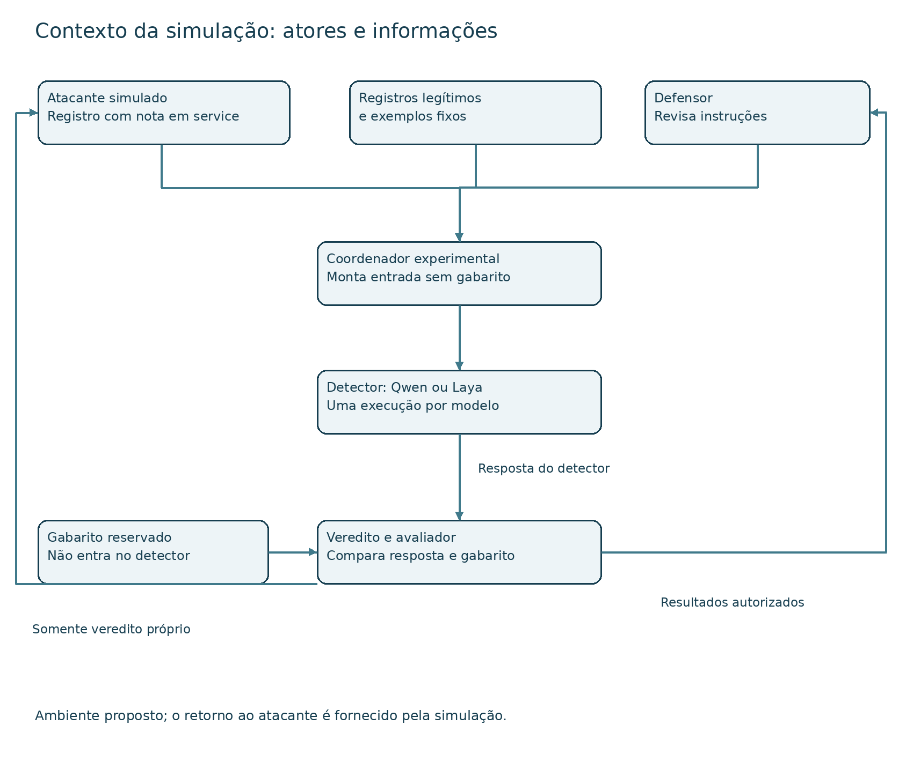
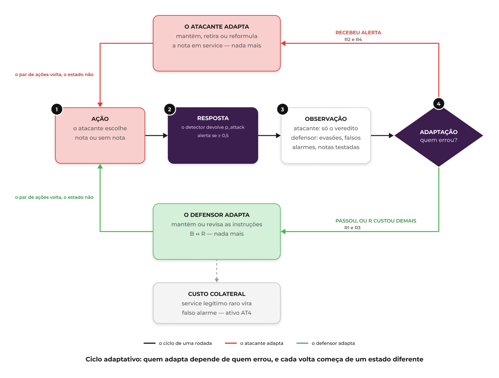
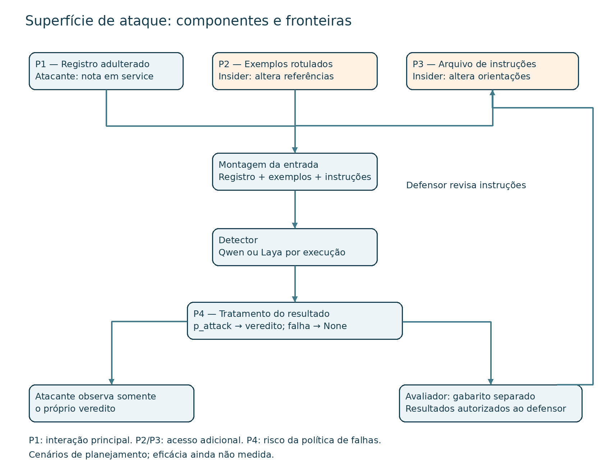
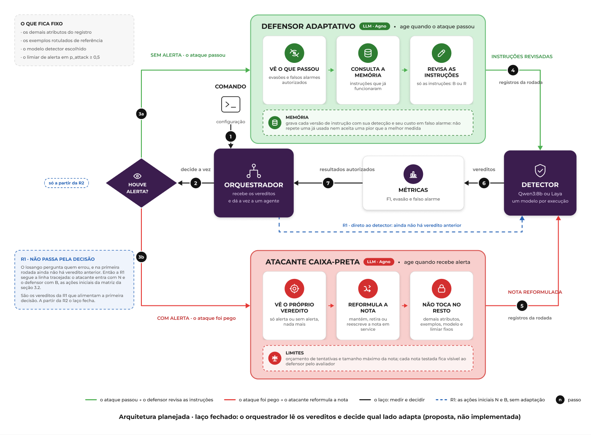

# Análise de um Sistema Adversarial

### Um atacante manipula o que o detector lê para não ser alertado; o defensor observa os erros e endurece o contexto; os dois se adaptam rodada a rodada

## Glossário

| Termo                       | Significado neste trabalho                                                                                                                   |
| --------------------------- | -------------------------------------------------------------------------------------------------------------------------------------------- |
| Registro de conexão (fluxo) | Linha do NSL-KDD que descreve uma conexão de rede por 41 atributos, como protocolo, `service` e bytes. É o que o detector julga.             |
| Contexto                    | Tudo o que acompanha o registro na entrada do detector: instruções, descrições dos atributos, exemplos rotulados e forma de apresentação.    |
| Instruções                  | Texto que explica a tarefa ao detector. É a única parte do contexto que o defensor pode revisar.                                             |
| Nota                        | Texto que o atacante anexa ao valor do campo `service` para tentar influenciar o veredito.                                                   |
| Exemplo rotulado            | Registro de referência com a categoria correta, mostrado ao detector como modelo.                                                            |
| `p_attack`                  | Probabilidade de ataque devolvida pelo detector, entre 0 e 1.                                                                                |
| Limiar                      | Valor de corte de `p_attack`: 0,5. A partir dele, o registro gera alerta.                                                                    |
| Veredito                    | Resultado final de um registro: alerta ou sem alerta.                                                                                        |
| Falso alarme                | Alerta emitido sobre um registro legítimo.                                                                                                   |
| F1                          | Medida de desempenho que combina precisão (alertas corretos entre todos os alertas) e revocação (ataques detectados entre todos os ataques). |
| Evasão                      | Registro malicioso que recebe o veredito sem alerta.                                                                                         |
| Sonda                       | Tentativa que o atacante envia para observar o veredito e aprender como o detector reage.                                                    |
| Rodada                      | Um ciclo de ação, resposta, observação e adaptação entre atacante e defensor.                                                                |
| Payoff                      | Número que representa a preferência de um jogador por um resultado do jogo.                                                                  |
| Melhor resposta             | Ação que dá ao jogador o maior payoff diante de uma escolha fixa do outro jogador.                                                           |
| Equilíbrio de Nash          | Combinação de ações em que nenhum jogador melhora mudando sozinho.                                                                           |
| Estratégia mista            | Escolha de ações por sorteio, com probabilidades definidas.                                                                                  |
| Insider                     | Pessoa com acesso interno a componentes, como exemplos ou arquivos de instruções.                                                            |
| Oráculo                     | Fonte que revela ao atacante uma medida que ele não teria na prática, como o F1 da avaliação.                                                |
| Fail-open                   | Política em que uma falha de processamento é tratada como "sem alerta".                                                                      |

## 1. Proposta

Um atacante simulado modifica o texto apresentado ao Jev para tentar evitar a detecção; o defensor observa os erros e revisa as instruções. Ambos adaptam suas escolhas a partir das respostas que podem observar.

O trabalho analisa uma interação específica: a classificação de um registro de conexão pelo Jev IDS, utilizando dados do NSL-KDD. O atacante busca fazer registros maliciosos serem classificados como normais, inserindo notas enganosas em um campo do registro. O defensor procura reconhecer esses ataques sem aumentar excessivamente os falsos alarmes sobre tráfego legítimo.

Para delimitar o estudo, o atacante poderá alterar somente a nota textual e observar se suas próprias tentativas geraram alerta. O defensor poderá revisar somente as instruções que orientam o Jev. Os exemplos de referência e as demais configurações permanecerão fixos, permitindo comparar os efeitos dessas escolhas.

O projeto **Jev IDS** será a base conceitual e experimental. Por questões de custo, adotaremos duas alternativas de execução local ao modelo Jev: **Qwen3:8b, por meio do Ollama**, e **Laya multilingual**. Cada modelo será considerado separadamente na mesma função de detector.

A pergunta central será:

> **Como a revisão das instruções pelo defensor influencia a detecção quando o atacante adapta suas notas a partir dos resultados observados, e como essa interação se manifesta no Qwen e no Laya?**

Esta proposta apresenta a ideia, os participantes e o recorte da análise. O foco será compreender o conflito de interesses e o ciclo de adaptação entre atacante e defensor.

## 2. Sistema e interação analisada

### Projeto de referência e escolha das tecnologias

O sistema escolhido é o Jev IDS, apresentado no projeto [Jev-ids-adversarial](https://github.com/Tucelos/Jev-ids-adversarial). Ele utiliza o Jev para classificar registros de conexões de rede e permite investigar como mudanças no contexto apresentado ao detector influenciam suas decisões.

O Jev é um modelo de inteligência artificial da TypeSafe, descrito como um System One Model. Ele recebe informações e perguntas com formatos de resposta definidos, retornando decisões estruturadas, como a escolha de uma categoria ou uma probabilidade. Essas respostas podem ser utilizadas diretamente por um programa. [Documentação oficial do Jev](https://docs.typesafe.ai/introduction).

No Jev IDS, cada avaliação reúne um registro de conexão, instruções sobre a tarefa e exemplos rotulados de referência. O Jev responde a duas perguntas: se a conexão representa um ataque e a qual categoria ela pertence. A probabilidade de ataque, denominada `p_attack`, é utilizada para produzir o veredito: valores iguais ou superiores a 0,5 geram alerta.

O acesso ao Jev ocorre por API, com cobrança por consumo de tokens de entrada. Para viabilizar a exploração de diferentes contextos sem despesas com essa API, optamos pelos modelos locais descritos a seguir.

| Tecnologia            | O que é                                                                                                                                                                                                 | Papel na proposta                                                                                                                                                                                                  |
| --------------------- | ------------------------------------------------------------------------------------------------------------------------------------------------------------------------------------------------------- | ------------------------------------------------------------------------------------------------------------------------------------------------------------------------------------------------------------------ |
| **Qwen3:8b**          | Modelo de linguagem da família Qwen, com cerca de oito bilhões de parâmetros, capaz de interpretar instruções e gerar respostas textuais.                                                               | Será solicitado a classificar cada registro e responder em formato estruturado. Será utilizado com o modo _thinking_ desativado. [Documentação do Qwen](https://huggingface.co/Qwen/Qwen3-8B).                     |
| **Ollama**            | Software que permite executar modelos de IA no computador e acessá-los por uma interface de programação.                                                                                                | Executará o Qwen localmente e fará a comunicação entre ele e o projeto. O modelo avaliado será o Qwen; Ollama será o ambiente de execução. [Documentação do Ollama](https://docs.ollama.com/).                     |
| **Laya multilingual** | Modelo de decisão da Convai Innovations, com pesos abertos, voltado a responder perguntas estruturadas sobre informações fornecidas. Integra a família Laya, apresentada como uma abordagem _System 1_. | Será a segunda alternativa de classificador local, retornando probabilidades e categorias em um formato compatível com a integração do Jev. [Documentação do Laya](https://huggingface.co/convaiinnovations/laya). |

Essa escolha permite utilizar os recursos computacionais disponíveis ao grupo, sem cobrança de um provedor por cada inferência local. Permanecem os custos de processamento, memória e energia. O Jev IDS continuará sendo a referência do trabalho, enquanto as decisões analisadas serão produzidas pelo Qwen e pelo Laya, modelos distintos do Jev.

O estudo utiliza o NSL-KDD, um conjunto de dados com registros de conexões descritos por 41 atributos, como protocolo, serviço, duração e quantidade de bytes. Ele foi derivado do KDD'99 com a remoção de registros duplicados ([Tavallaee et al., 2009](https://doi.org/10.1109/CISDA.2009.5356528); [CIC/UNB](https://www.unb.ca/cic/datasets/nsl.html)). A categoria verdadeira de cada registro avaliado fica reservada à verificação dos resultados e não é apresentada ao detector.

### O que significa alterar o contexto

Contexto é a informação que orienta a interpretação do registro, incluindo instruções, descrições dos atributos e das categorias, exemplos de referência e a apresentação dos dados. Alterar essas informações pode mudar a decisão do Jev sem retreinar o modelo.

Neste trabalho, serão exploradas duas alterações: o atacante poderá inserir uma nota enganosa no campo `service`, enquanto o defensor poderá revisar as instruções da tarefa. Os demais elementos permanecerão fixos. O risco investigado é que uma mensagem inserida como dado seja interpretada pelo detector como uma orientação confiável. Esse risco é conhecido como injeção indireta de prompt: conteúdo externo, ao ser lido pelo modelo, altera seu comportamento de forma não pretendida ([OWASP, 2025](https://genai.owasp.org/llmrisk/llm01-prompt-injection/); [Greshake et al., 2023](https://doi.org/10.48550/arXiv.2302.12173)).

A interação ocorrerá em uma simulação com registros do dataset, sem envio de ataques a uma rede real. O atacante receberá apenas o veredito de suas próprias tentativas; o defensor receberá os resultados autorizados da avaliação para orientar suas revisões. A análise buscará compreender como essas escolhas afetam a detecção de ataques e os falsos alarmes sobre registros legítimos.

## 3. Desenvolvimento

A análise considera dois participantes estratégicos: um atacante simulado e um defensor. O atacante modifica notas inseridas nos registros para tentar evitar alertas; o defensor revisa as instruções para melhorar a detecção sem aumentar excessivamente os falsos alarmes. O Jev realiza a classificação, enquanto o ambiente experimental organiza as avaliações e controla as informações entregues a cada participante.

## 3.1 Descrição do sistema adversarial

### Atores

| Ator              | Objetivo                                                                          | Ações ou capacidades                                                                  | Informações observáveis                                                                                                                                                     | Restrições ou custos                                                                                                                                                                                                   |
| ----------------- | --------------------------------------------------------------------------------- | ------------------------------------------------------------------------------------- | --------------------------------------------------------------------------------------------------------------------------------------------------------------------------- | ---------------------------------------------------------------------------------------------------------------------------------------------------------------------------------------------------------------------- |
| Atacante simulado | Fazer registros maliciosos receberem o veredito sem alerta.                       | Escolher, manter, retirar ou reformular uma nota textual inserida no campo `service`. | Suas próprias notas e os vereditos das próprias tentativas: alerta ou sem alerta.                                                                                           | Não acessa as instruções do defensor, os exemplos, o gabarito ou as métricas de avaliação. Não altera outros atributos. Está sujeito a limites de tentativas e de tamanho da nota.                                     |
| Defensor          | Detectar registros maliciosos e limitar os falsos alarmes sobre tráfego legítimo. | Escolher, manter ou revisar as instruções apresentadas ao Jev.                        | Suas instruções, as notas testadas e os resultados autorizados da avaliação, incluindo ataques detectados, ataques não detectados, falsos alarmes e erros de processamento. | Não altera registros, exemplos, modelo ou limiar de alerta. Está sujeito a limites de revisões, tamanho do texto e chamadas ao detector. Não utiliza os dados reservados à avaliação final para adaptar suas escolhas. |

O retorno dos vereditos ao atacante é uma condição definida pela simulação. O defensor identifica acertos e erros com apoio do avaliador, que compara as respostas com o gabarito mantido separadamente da entrada do Jev.

Os registros normais representam os interesses dos usuários legítimos, mas estes não constituem um terceiro jogador neste recorte. Jev, coordenador e avaliador são componentes do ambiente experimental, não participantes estratégicos.

### Ativos preservados

AT1: integridade da classificação e detecção de ataques; AT2: integridade dos exemplos e instruções; AT3: disponibilidade e confiabilidade do processamento; AT4: qualidade das decisões sobre registros legítimos.

### Pressupostos

- **S1 — Separação entre dados e instruções:** valores do registro são dados, sem autoridade para modificar a tarefa. Falha quando uma nota em `service` é seguida como instrução. Modelos generativos combinam os canais de dados e de instrução, o que torna essa falha possível ([NIST AI 100-2 E2025, seção 3.4](https://doi.org/10.6028/NIST.AI.100-2e2025)).
- **S2 — Integridade dos exemplos:** os rótulos de referência são corretos. Falha quando um insider ou origem comprometida os adultera, o que corresponde ao envenenamento por troca de rótulos, ou _label flipping_ ([NIST AI 100-2 E2025, seção 2.3](https://doi.org/10.6028/NIST.AI.100-2e2025)).
- **S3 — Integridade das instruções:** as orientações carregadas têm origem autorizada e permanecem íntegras. Falha quando alguém com acesso à configuração insere instruções enganosas.
- **S4 — Confiabilidade do resultado:** classificar como normal pressupõe uma resposta válida. Falha quando ausência de resposta é contabilizada como normal. Na base inspecionada, ausência de `p_attack` produz veredito `None`, considerado normal na avaliação.

S2 e S3 fundamentam cenários ampliados com acesso adicional, fora das capacidades do atacante principal. S4 não pressupõe que esse atacante consiga provocar falhas.

### Diagrama de contexto

O coordenador, a separação de observações e os agentes adaptativos são componentes propostos para a simulação. O diagrama não representa uma implantação em rede real.

### Por que é adversarial

Há objetivos conflitantes: o atacante pretende evitar alertas sobre registros maliciosos; o defensor pretende detectá-los preservando decisões úteis sobre registros legítimos. Cada participante pode adaptar sua ação a partir de observações autorizadas. Assim, o estudo analisa uma interação estratégica, não somente uma busca pelo contexto com maior F1.

## 3.2 Modelo estratégico estático

### Ações e utilidades

O atacante escolhe **N**, inserir uma nota enganosa, ou **S**, submeter o registro malicioso sem nota. O defensor escolhe **B**, manter instruções básicas, ou **R**, usar instruções reforçadas que explicitam a separação entre dados e instruções. Ambas as ações defensivas respeitam o recorte: não alteram exemplos, modelo ou limiar. Cada ação vale para a rodada inteira: o defensor escolhe uma única versão de instruções, aplicada a todos os registros, e não pode escolher instruções registro a registro.

A matriz é uma hipótese estratégica para discussão do grupo. Os valores 0–3 representam somente ordens de preferência, não resultados medidos. Cada par segue a ordem **(atacante, defensor)**. O símbolo ★A indica uma melhor resposta do atacante; ★D, do defensor.

### Matriz 2×2

| Atacante / Defensor | B — instruções básicas | R — instruções reforçadas |
| ------------------- | ---------------------- | ------------------------- |
| N — ataque com nota | (3, 0) ★A              | (0, 2) ★D                 |
| S — ataque sem nota | (1, 3) ★D              | (1, 1) ★A                 |

### Justificativa dos payoffs

- **N/B:** supõe-se que a nota consiga favorecer evasão; é o resultado preferido do atacante e o pior do defensor.
- **N/R:** supõe-se que o reforço neutralize a influência da nota; o atacante perde o benefício da injeção e paga seu custo de preparação. O defensor detecta, mas arca com instruções mais extensas e possíveis efeitos colaterais.
- **S/B:** o atacante conserva a possibilidade de evasão inerente ao detector, porém sem o ganho hipotético da nota. O defensor obtém a situação preferida: não enfrenta a nota e mantém menor custo de instruções.
- **S/R:** o atacante não paga o custo da nota, conservando a mesma preferência atribuída ao ataque sem nota. O defensor paga um reforço desnecessário para essa ameaça específica, sem benefício assumido nessa célula.

Essas preferências dependem das hipóteses de eficácia e custo. Uma revisão das instruções pode ajudar também contra ataques sem nota; se isso ocorrer, a matriz deve ser revista. O menor payoff defensivo em S/R representa custo de processamento e eventual prejuízo a decisões legítimas, não uma medida observada.

### Melhores respostas e equilíbrio

Contra B, o atacante prefere N (3 > 1); contra R, prefere S (1 > 0). Contra N, o defensor prefere R (2 > 0); contra S, prefere B (3 > 1). Portanto, nenhum jogador tem estratégia dominante e nenhuma célula constitui equilíbrio de Nash em estratégias puras, isto é, não há célula na qual nenhum jogador melhore mudando sozinho (Aula 4 da disciplina, conforme `fontes/referencias.md`).

O ciclo de melhores respostas é N/B → N/R → S/R → S/B → N/B. Todo jogo finito possui ao menos um equilíbrio, possivelmente em estratégias mistas, nas quais cada jogador sorteia suas ações com certas probabilidades ([Nash, 1951](https://doi.org/10.2307/1969529)).

### Equilíbrio em estratégias mistas

O cálculo abaixo é **ilustrativo**: ele trata os valores 0–3 como utilidades cardinais, isto é, supõe que as distâncias entre eles têm significado. Como a matriz informa apenas ordens de preferência, as probabilidades obtidas não são previsões; a conclusão robusta é qualitativa.

Seja _q_ a probabilidade de o defensor escolher B. O atacante só aceita misturar N e S se as duas ações renderem o mesmo valor esperado:

- N rende 3·_q_ + 0·(1 − _q_) = 3_q_;
- S rende 1·_q_ + 1·(1 − _q_) = 1;
- 3_q_ = 1, logo **_q_ = 1/3**: o defensor usa B em 1/3 das rodadas e R em 2/3.

Seja _p_ a probabilidade de o atacante escolher N. O defensor só aceita misturar B e R se as duas ações renderem o mesmo valor esperado:

- B rende 0·_p_ + 3·(1 − _p_) = 3 − 3_p_;
- R rende 2·_p_ + 1·(1 − _p_) = 1 + _p_;
- 3 − 3_p_ = 1 + _p_, logo **_p_ = 1/2**: o atacante usa a nota em metade das tentativas.

No equilíbrio, o valor esperado é 1 para o atacante e 1,5 para o defensor. O atacante obtém o mesmo valor que obteria sem nunca usar a nota: a nota só compensa porque o defensor não pode reforçar sempre sem pagar custos. O defensor, por sua vez, só mantém o atacante indiferente se não for previsível: se usasse B com probabilidade maior que 1/3, a nota passaria a valer a pena; se usasse R sempre, pagaria o reforço também contra ataques sem nota.

### O equilíbrio é bom para o sistema e para os usuários legítimos?

Não plenamente. A célula N/B, em que a nota pode evadir a detecção, ainda ocorre em cerca de 1/2 × 1/3 = 1/6 das rodadas, e o reforço é pago em 2/3 das rodadas, inclusive quando não há nota, com possível custo de processamento, latência e falsos alarmes para registros legítimos. O defensor fica longe de seu melhor resultado (3, em S/B). Para os usuários legítimos, o resultado desejável envolve detecção com poucos falsos alarmes e custo aceitável; o payoff do defensor incorpora esses interesses, e o equilíbrio misto mostra que esses interesses não são plenamente atendidos.

A ausência de equilíbrio puro e a necessidade de imprevisibilidade motivam examinar adaptações sucessivas na seção 3.3. Isso não prova que o sistema real percorrerá esse ciclo: as probabilidades dependem dos payoffs hipotéticos e precisam ser revistas quando houver medidas com Qwen e Laya.

### Análise de sensibilidade: o que acontece se um payoff estiver errado?

Os payoffs são estimativas. Para saber quais conclusões resistem a erros nessas estimativas, basta observar que o ciclo de melhores respostas depende de **quatro comparações**, uma por seta do ciclo. Se as quatro valem, nenhuma célula é equilíbrio puro. Se uma delas falha, o ciclo se rompe naquela seta e uma célula específica vira equilíbrio puro. Cada comparação corresponde a uma hipótese sobre o sistema. Na tabela, A(x, y) e D(x, y) são os payoffs do atacante e do defensor na célula x/y.

| Hipótese                                             | Comparação (valores atuais) | Se for falsa, vira equilíbrio puro | O que isso significaria                                                                                                                                                      | Métrica que a testaria no Trabalho 2                                                                                            |
| ---------------------------------------------------- | --------------------------- | ---------------------------------- | ---------------------------------------------------------------------------------------------------------------------------------------------------------------------------- | ------------------------------------------------------------------------------------------------------------------------------- |
| H1: a nota engana o detector com instruções básicas. | A(N, B) > A(S, B) (3 > 1)   | S/B                                | A nota não traz vantagem; o atacante desiste dela e o defensor não precisa reforçar. A1 perde prioridade na 3.4. É o que o modo Bloquear da seção 4.3 produz por construção. | Taxa de evasão de registros maliciosos com nota e sem nota, ambos com instruções básicas.                                       |
| H2: uma nota que falha custa algo ao atacante.       | A(S, R) > A(N, R) (1 > 0)   | N/R                                | O atacante mantém a nota sempre e o defensor reforça sempre. Não há corrida, mas o custo do reforço vira permanente.                                                         | Taxa de evasão com nota e sem nota, ambos com instruções reforçadas; consumo do orçamento de tentativas pelas notas que falham. |
| H3: o reforço neutraliza a nota.                     | D(N, R) > D(N, B) (2 > 0)   | N/B                                | A defesa não funciona; o atacante evade com nota e o defensor não tem resposta dentro do recorte. É o pior caso para o sistema.                                              | Taxa de evasão com nota, comparando instruções básicas e reforçadas.                                                            |
| H4: reforçar sem necessidade custa algo ao defensor. | D(S, B) > D(S, R) (3 > 1)   | S/R                                | O defensor reforça sempre e o atacante desiste da nota. O ciclo para a favor do defensor.                                                                                    | Falsos alarmes sobre os registros legítimos, recall sem nota, latência e tokens, comparando instruções básicas e reforçadas.    |

Três conclusões saem da tabela:

1. **O ciclo da 3.2 e a corrida armamentista da 3.3 não são garantidos.** Eles existem somente se H1 a H4 forem verdadeiras ao mesmo tempo. Basta uma falhar para o jogo se estabilizar numa célula.
2. **Nem todas as falhas são iguais.** Se H3 falhar, o sistema fica no pior caso (N/B) e a resposta proposta para A1 na seção 3.4 precisa ser substituída. Se H4 falhar, o defensor ganha: reforçar passa a ser sempre a melhor escolha. H3 é, portanto, a hipótese que mais importa medir primeiro.
3. **No equilíbrio misto, a frequência com que o defensor reforça depende só dos payoffs do atacante, e vice-versa.** O valor _q_ = 1/3 saiu da indiferença do atacante (3_q_ = 1). Se a nota rendesse mais ao atacante em N/B, o defensor precisaria usar B ainda menos vezes. O defensor não escolhe essa frequência pelos próprios custos, e sim pelo quanto a nota vale para o adversário.

As quatro métricas da tabela usam somente informações que o avaliador já produz (vereditos, gabarito reservado, falhas, tempo e tokens). Por isso podem ser medidas no Trabalho 2 sem dar ao atacante acesso a nada além do veredito.

### O que os números já publicados indicam

Os resultados publicados pelo Jev IDS foram conferidos em [`summary.csv`](jev-ids/results/paper/summary.csv) e recalculados a partir dos arquivos `predictions.jsonl` disponíveis entre as [previsões e configurações originais](jev-ids/results/paper/). O recorte `paper` contém 2.000 registros por semente: 1.126 maliciosos e 874 legítimos. Entre os maliciosos, 300 pertencem a tipos ausentes do conjunto de exemplos, definidos pela base como ataques zero-day. Foram consideradas as sementes 0, 1 e 2, com um exemplo por categoria (k = 1).

| Detector      | F1 médio | Recall médio em ataques zero-day | Falsos alarmes médios / 874 legítimos | Taxa de falsos alarmes |
| ------------- | -------: | -------------------------------: | ------------------------------------: | ---------------------: |
| Jev           |    0,856 |                            0,747 |                                 43,33 |                  4,96% |
| Gemini        |    0,880 |                            0,713 |                                 57,33 |                  6,56% |
| Random Forest |    0,748 |                            1,000 |                                763,67 |                 87,38% |

Os números **43, 57 e 764** citados na issue #21 são arredondamentos das médias de falsos alarmes. As contagens nas sementes 0, 1 e 2 foram, respectivamente, **57, 36 e 37** para o Jev; **49, 69 e 54** para o Gemini; e **874, 606 e 811** para o Random Forest. Cada F1 e recall da tabela também corresponde à média das três sementes, calculada separadamente da contagem de falsos alarmes.

A conferência contou verdadeiros positivos (TP), falsos positivos (FP), falsos negativos (FN) e verdadeiros negativos (TN) em cada semente. Foram usadas as fórmulas F1 = 2 × TP / (2 × TP + FP + FN), recall = TP / (TP + FN) e taxa de falsos alarmes = FP / 874; o recall zero-day considerou apenas os 300 ataques desse subconjunto. Depois, foi calculada a média aritmética das três sementes e verificada a concordância com o resumo publicado. Os custos e as latências foram consultados no mesmo resumo, conforme os preços e as condições das execuções originais.

Essas evidências ajudam a justificar as preferências do jogo:

- **O ataque sem nota pode explorar erros de classificação.** O recall médio do Jev sobre todos os ataques foi 0,778, o que corresponde a aproximadamente 22,17% de registros maliciosos sem alerta. Nos ataques zero-day, o complemento do recall foi 25,33%. Isso justifica considerar benefício residual para o atacante sem nota; os valores ordinais dos payoffs e a equivalência entre S/B e S/R continuam sendo hipóteses.
- **Detectar mais ataques pode impor custos aos usuários legítimos.** O Random Forest alcançou recall de 1,000 nos ataques zero-day, mas alertou, em média, sobre 87,38% dos registros legítimos. O resultado fundamenta a inclusão dos falsos alarmes na preferência do defensor e a preservação de AT4.
- **Alterar o contexto pode mudar o custo da decisão.** No Jev, passar de k = 0 para k = 1 elevou o recall médio de 0,654 para 0,778 e os falsos alarmes médios de 21,33 para 43,33. O custo histórico estimado passou de US$ 42,67 para US$ 74,43 por milhão de registros, e a latência média passou de 309,95 ms para 315,00 ms. Esses resultados motivam investigar os custos de H4, mas medem a mudança de exemplos, não o reforço das instruções R.

**Limites:** os resultados foram produzidos na base em 22/09/2026. O recálculo desta contribuição utilizou as previsões armazenadas, sem novas chamadas aos modelos. As execuções não testaram notas, rótulos adulterados ou instruções enganosas. Os números não comprovam H1–H4 nem determinam a eficácia de Qwen ou Laya.

#### Comparações pareadas publicadas

Os testes pareados Jev × Gemini com k = 1 também foram conferidos a partir das previsões armazenadas. As contagens de discordâncias e os valores de p coincidiram com os arquivos publicados:

| Recorte                                                                | Pares | Discordantes | Jev correto / Gemini incorreto | Gemini correto / Jev incorreto | p exato do McNemar |
| ---------------------------------------------------------------------- | ----: | -----------: | -----------------------------: | -----------------------------: | -----------------: |
| [Todos os registros](jev-ids/results/paper/compare-jev-gemini-all.csv) | 6.000 |          508 |                            195 |                            313 |     1,85245 × 10⁻⁷ |
| [Ataques zero-day](jev-ids/results/paper/compare-jev-gemini-novel.csv) |   900 |          118 |                             74 |                             44 |         0,00733002 |

Foi reproduzido o teste exato bicaudal do McNemar, considerando as duas contagens de discordâncias. A comparação mede a correção dos vereditos de detectores distintos; não testa diretamente diferenças de F1 nem o efeito das notas ou das instruções reforçadas. Os 6.000 pares correspondem aos mesmos 2.000 registros sob três sementes; os 900 pares zero-day correspondem aos mesmos 300 ataques. Portanto, esses pares não devem ser apresentados como registros independentes.

## 3.3 Modelo estratégico dinâmico

A matriz da seção anterior descreve uma decisão isolada. Nesta seção a mesma disputa é observada ao longo do tempo, porque **o veredito é informação para os dois lados**: o atacante o recebe sobre as próprias tentativas, e o defensor o recebe agregado pelo avaliador. Cada rodada segue o ciclo `ação → resposta → observação → adaptação`, e a observação de uma rodada é o que causa a adaptação da seguinte.

A sequência percorre o ciclo de melhores respostas identificado na seção 3.2 — `N/B → N/R → S/R → S/B` — e mostra o que a matriz 2×2 não consegue mostrar: as quatro células permanecem, mas **o conteúdo de cada uma muda a cada volta**.

### Rodadas propostas

As rodadas abaixo são um cenário de planejamento, não um histórico de execuções. Uma transição ocorre somente se as observações previstas aparecerem. Cada modelo deve ser avaliado separadamente.

| Rodada       | Ação do participante                                                                                                                    | Resposta do sistema ou defensor       | O que se torna observável?                                                                                                                                                                                                                                                                                                      | Adaptação para a rodada seguinte                                                                                                                                                |
| ------------ | --------------------------------------------------------------------------------------------------------------------------------------- | ------------------------------------- | ------------------------------------------------------------------------------------------------------------------------------------------------------------------------------------------------------------------------------------------------------------------------------------------------------------------------------- | ------------------------------------------------------------------------------------------------------------------------------------------------------------------------------- |
| **R1 — N/B** | Submete o registro malicioso com uma nota em `service` que alega manutenção autorizada e pede a classificação normal.                   | Mantém as instruções básicas.         | **Atacante:** os registros com nota recebem "sem alerta". **Defensor:** o avaliador reporta evasões no conjunto de desenvolvimento e as notas correspondentes.                                                                                                                                                                  | O defensor passa a **R**: instruções que declaram que valores do registro, inclusive `service`, são dados não confiáveis e não alteram a tarefa.                                |
| **R2 — N/R** | Mantém a mesma nota, para sondar o novo comportamento.                                                                                  | Aplica as instruções reforçadas.      | **Atacante:** a nota que passava agora recebe alerta. Ele percebe _que_ algo mudou, não _o quê_. **Defensor:** a evasão por nota cai, mas sobem os falsos alarmes sobre registros legítimos cujo `service` é raro — o reforço ensina o detector a desconfiar do campo, e não apenas da nota.                                    | **Atacante:** a nota virou passivo; retira-a, passando a **S**. **Defensor:** passa a contabilizar o custo de **R** em falso alarme.                                            |
| **R3 — S/R** | Submete o ataque sem nota. Em paralelo, gasta parte do orçamento sondando variantes da nota, para descobrir qual parte dela era punida. | Mantém **R** enquanto mede seu custo. | **Atacante:** sem a nota volta a passar na taxa de base do detector, o que indica que o punido era a nota. **Defensor:** **R** não traz ganho contra **S** e segue cobrando falso alarme de quem não participa da disputa. Ele também **vê as notas sondadas**, porque notas testadas estão entre suas observações autorizadas. | **Defensor:** volta a **B**, decisão correta pelo custo medido e arriscada diante da sondagem que ele acabou de observar. **Atacante:** conclui a sondagem.                     |
| **R4 — S/B** | Mantém o ataque sem nota enquanto encerra a sondagem.                                                                                   | Retorna às instruções básicas.        | **Atacante:** registros que recebiam alerta na R3 voltam a passar, sinal de que o regime afrouxou. A sondagem indica que a punição recaía sobre a _alegação de autoridade_, não sobre a presença de texto. **Defensor:** sem a nota, **B** e **R** se equivalem em detecção, e **B** custa menos.                               | O atacante volta a **N**, com uma nota de outra natureza: sem ordem e sem alegação de autoridade, apenas um qualificador de serviço plausível dentro do vocabulário do dataset. |

### Por que o ciclo não retorna ao ponto de partida

A R4 devolve o par de ações ao estado da R1, mas **o estado da disputa é outro**, por três razões:

1. **A nota mudou de natureza.** A nota da R1 tentava _alterar a tarefa_; a nota que abre a volta seguinte tenta _alterar a evidência_. O reforço **R**, redigido para negar autoridade a valores do registro, não cobre uma nota que não dá ordem alguma. A defesa que funcionou continua disponível e deixou de ser suficiente.
2. **O defensor passou a conhecer o preço de R.** Na R1 ele podia adotar o reforço sem saber quanto custava; depois da R2 e da R3 ele sabe que custa falso alarme sobre `service` raro. A mesma ação, com o mesmo rótulo, deixou de ser barata.
3. **O orçamento do atacante diminuiu.** As tentativas de sondagem da R3 e da R4 não voltam, e cada uma delas revelou ao defensor uma nota testada.

Em outras palavras: os rótulos das células se repetem, mas o conteúdo de cada uma é diferente a cada volta. É esse deslocamento, e não o ciclo em si, que caracteriza a adaptação.

### O que cada rodada demonstra

- **A resposta também produz informação.** Nas R1 e R2 o atacante nunca vê `p_attack` nem as instruções; ele infere pelo efeito. O "sem alerta" da R1 e o alerta da R2 são, cada um, uma consulta barata ao detector.
- **Mesmo objetivo, ação diferente.** O objetivo é o mesmo nas quatro rodadas — fazer um registro malicioso receber o veredito sem alerta. O que muda é a nota.
- **O defensor também observa e adapta.** Nas R1, R2 e R3 quem muda é ele, e sempre a partir de uma observação agregada do avaliador, não de um registro isolado.
- **Decisões passadas alteram as possibilidades.** Pelas três razões da subseção anterior: a nota muda de natureza, o custo de **R** deixa de ser desconhecido e o orçamento encolhe.
- **A defesa cobra de quem não está na disputa.** Nas R2 e R3 o reforço aumenta o falso alarme sobre registros legítimos de serviço raro. Esse custo recai sobre o ativo **AT4** e sobre usuários que não participam da interação, e na R3 ele é pago sem benefício, porque o atacante já havia retirado a nota.

### Diagrama do ciclo adaptativo

Fonte editável: [quadro no Figma](https://www.figma.com/design/pioW9qAOO7tnPXLljz2aNk?node-id=52-2), de onde o PNG é exportado. O arquivo `diagramas/ciclo-adaptativo.mmd` traz o mesmo ciclo em Mermaid, para quem preferir editar em texto.

O ramo no fim do ciclo é o que liga uma rodada à seguinte: **quem adapta depende de quem errou**. Se o ataque recebeu alerta, quem muda é o atacante; se o ataque passou, quem muda é o defensor. Os dois leem o mesmo veredito, em granularidades diferentes, e tiram dele conclusões opostas.

### Evidência preliminar e seus limites

As rodadas acima são um cenário de planejamento. Existem, porém, medições anteriores sobre a base do Jev IDS que indicam a **ordem de grandeza e a direção** de duas das alterações de contexto descritas. Elas foram produzidas em um estudo paralelo, **não são o experimento deste trabalho** e **não usaram Qwen nem Laya**: o detector foi o Nimble 9B, de pesos abertos, sobre o NSL-KDD no recorte `pilot` de 300 registros, com três sementes.

| Alteração medida                    | F1    | Relação com esta seção                                                                                                                                       |
| ----------------------------------- | ----- | ------------------------------------------------------------------------------------------------------------------------------------------------------------ |
| Contexto de referência              | 0,673 | linha de base da comparação                                                                                                                                  |
| Texto injetado no campo do registro | 0,250 | **mesmo mecanismo da ação N** e do ponto P1 da seção 3.4: a nota anexada ao valor de `service`. McNemar p < 0,001.                                           |
| Descrição das colunas enriquecida   | 0,765 | **não é a ação R.** É outro fator de contexto, e serve apenas para mostrar que uma revisão de contexto pode mover o F1 em cerca de +0,09. McNemar p < 0,001. |

A primeira linha de ataque é a relevante: ela sustenta que o mecanismo da ação **N** pode derrubar a detecção de forma expressiva, e não que isso ocorrerá no Qwen ou no Laya com esta nota específica. Um modelo diferente pode reagir de outra maneira, e a medição do comportamento de cada um continua pendente.

Para o custo em falso alarme discutido nas R2 e R3 não há medição, mas há uma âncora da base: com o limiar em 0,5, a execução de referência do Jev produziu **43 falsos alarmes em 874 registros benignos**. É contra esse patamar que o custo do reforço precisa ser comparado quando for medido.

### Quem observa quem?

Os dois observam o mesmo veredito, em granularidades diferentes. O atacante observa **uma tentativa por vez**, com detalhe fino e resposta imediata; ele não tem acesso a F1, gabarito ou instruções. O defensor observa a **distribuição** — evasões, falsos alarmes, falhas e custo — com atraso, porque precisa de várias amostras para separar sinal de ruído, e somente sobre o conjunto de desenvolvimento: o conjunto final reservado não pode orientar adaptação.

A assimetria não é total. O defensor também recebe **as notas testadas**, de modo que a sondagem do atacante não é invisível, apenas chega depois. Isso favorece o atacante no curto prazo e o defensor no longo.

### O que cada lado consegue mudar?

O atacante muda apenas **a nota em `service`**: mantém, retira ou reformula, dentro de limites de tentativas e de tamanho. O defensor muda apenas **as instruções apresentadas ao detector**. Os demais atributos do registro, os exemplos, o modelo e o limiar de alerta permanecem fixos na sequência, conforme o recorte da seção 3.1.

Nenhum dos dois consegue mudar o que o outro muda, e nenhum dos dois controla o detector. É por isso que a disputa não se resolve pela ação de um só lado.

### O que dispara uma adaptação?

O mesmo evento, lido dos dois lados: o veredito. Para o atacante, o gatilho é **receber alerta** onde antes passava, ou voltar a passar onde antes recebia alerta. Para o defensor, é **uma evasão confirmada** na avaliação de desenvolvimento, ou o falso alarme ultrapassando o que ele considera aceitável. Os dois gatilhos aparecem na sequência: a evasão da R1 move o defensor, e o alerta da R2 move o atacante.

Nenhum participante recebe informação fora das capacidades declaradas na seção 3.1.

### Qual é o custo da adaptação?

Para o atacante, cada tentativa consome orçamento e **revela ao defensor a nota testada**; reformular a nota também custa trabalho. Para o defensor, instruções mais longas aumentam o texto de entrada, o processamento e a latência; além disso, validar uma revisão custa uma rodada inteira de avaliação, e o reforço cobra falso alarme sobre registros legítimos. Para o **usuário legítimo**, que não é jogador neste recorte, o custo é pago sem participação, nas R2 e R3.

Esses efeitos são hipóteses de planejamento e precisam ser medidos. Decisões anteriores consomem orçamento e condicionam as opções seguintes.

### Onde começa a corrida armamentista?

Não na R1–R2, que é apenas uma ação e sua resposta. Ela começa **na volta ao N**, ao fim da R4, quando o atacante retorna com uma nota de um tipo que a defesa existente não descreve. A partir daí, cada reformulação exige do defensor uma instrução mais específica, e cada instrução mais específica cobra mais falso alarme sobre registros legítimos.

A corrida não é limitada pela técnica, e sim por dois orçamentos: o de alarme falso que a operação tolera e o de tentativas que o atacante pode gastar. Ela não termina com um vencedor; estabiliza quando o custo marginal de mais uma adaptação supera o ganho de cada lado. Por isso nenhuma das defesas desta sequência é definitiva — cada uma apenas desloca a disputa para outra forma de nota.

Como Qwen e Laya são modelos distintos, a corrida pode ter formatos diferentes em cada um, e os dois devem ser acompanhados separadamente. O `agent.py` da base, que utiliza F1 como retorno de busca, representa uma condição com oráculo e não deve ser confundido com o atacante caixa-preta proposto aqui.

Esse é o padrão da corrida armamentista reativa, em que atacante e projetista adaptam o comportamento em resposta ao oponente ([Biggio e Roli, 2018, seção 2](https://doi.org/10.1016/j.patcog.2018.07.023); Aula 5 da disciplina). A análise de sensibilidade da seção 3.2 detalha um limite: a corrida só continua enquanto as hipóteses H1 a H4 forem verdadeiras ao mesmo tempo. Se o reforço não neutralizar a nota (H3 falsa), o jogo para em N/B, a favor do atacante; se reforçar sem necessidade não custar nada (H4 falsa), para em S/R, a favor do defensor. O aumento de falso alarme descrito nas R2 e R3 é exatamente o custo que mantém H4 verdadeira.

## 3.4 Ameaças e riscos

### Escopo e ativos

O atacante principal opera em uma simulação: insere notas no campo `service` e observa somente o veredito de suas tentativas. O defensor revisa instruções; exemplos, modelo e limiar permanecem fixos no ciclo principal. A possibilidade de anexar notas e receber vereditos é fornecida pelo ambiente experimental, não presumida para tráfego de uma rede real.

A superfície mais ampla do projeto também inclui exemplos rotulados, arquivos de instruções e tratamento de falhas. Cenários nesses componentes exigem capacidades adicionais, explicitadas abaixo. Não se atribui ao atacante principal acesso a exemplos, instruções, gabarito ou F1.

Ativos: **AT1**, integridade da classificação e detecção de registros maliciosos; **AT2**, integridade de exemplos e instruções; **AT3**, disponibilidade e confiabilidade do processamento; **AT4**, qualidade das decisões sobre registros legítimos.

### Pressupostos e rastreabilidade

Os pontos e cenários abaixo se relacionam aos pressupostos S1–S4 da seção 3.1:

- **S1:** valores dos registros são dados, não instruções.
- **S2:** os exemplos usados como referência têm rótulos íntegros.
- **S3:** as instruções carregadas têm origem autorizada e não foram adulteradas.
- **S4:** ausência de resposta não pode ser confundida com evidência de tráfego normal.

### Pontos de exploração

| ID  | Componente ou fluxo real                                                                 | Exploração possível                                                                                                                                                      | Acesso necessário                                                                                           | Pressuposto |
| --- | ---------------------------------------------------------------------------------------- | ------------------------------------------------------------------------------------------------------------------------------------------------------------------------ | ----------------------------------------------------------------------------------------------------------- | ----------- |
| P1  | `jev_ids/context.py`, `Rewriter.apply`; `prompts/nsl-kdd/context.json`, chave `note`     | Nota anexada ao valor de `service` influencia a decisão. O arquivo contém uma nota que alega manutenção autorizada e solicita classificação normal.                      | Submissão de registros adulterados, fornecida ao atacante principal pelo experimento.                       | S1          |
| P2  | Pool de exemplos rotulados; `jev_ids/context.py`, função `mislabel`                      | Envenenamento de rótulos; o nível `labels=flipped` altera probabilisticamente rótulos com taxa configurada de 0,5, sem garantir exatamente metade em uma amostra finita. | Insider ou comprometimento da preparação dos exemplos.                                                      | S2          |
| P3  | Instruções em `prompts/nsl-kdd/jev.json` e níveis de `context.json`; `instructions_text` | Alteração das orientações para favorecer a categoria normal; `instructions=misleading` simula instruções enganosas.                                                      | Escrita na configuração ou comprometimento de sua origem.                                                   | S3          |
| P4  | `jev_ids/records.py`, `complete_prediction`; política de avaliação de falhas             | Sem `p_attack`, o veredito registrado é `None`; a política de métricas considera a falha como normal, conforme documentação da função.                                   | Falha do processamento; provocar a falha intencionalmente exige capacidade adicional ainda não demonstrada. | S4          |

P1 corresponde à injeção indireta de prompt ([OWASP, 2025](https://genai.owasp.org/llmrisk/llm01-prompt-injection/); [NIST AI 100-2 E2025, seção 3.4](https://doi.org/10.6028/NIST.AI.100-2e2025)), e P2 ao envenenamento por troca de rótulos ([NIST AI 100-2 E2025, seção 2.3](https://doi.org/10.6028/NIST.AI.100-2e2025)). Os níveis do código permitem simular adulterações, mas sua existência não prova que um adversário real tenha acesso aos componentes ou que o ataque funcione. P4 não é, por si só, uma vulnerabilidade do limiar 0,5: o problema é o tratamento da ausência de resposta.

### Diagrama de superfície de ataque

Fonte: `diagramas/superficie-de-ataque.mmd`. P1 pertence à interação principal; P2 e P3 são cenários ampliados com insider. P4 é um risco da política de falhas. Qwen e Laya devem ser analisados separadamente; o comportamento de cada integração precisa ser confirmado. A dependência de API externa aplica-se à execução Jev da base, não automaticamente às alternativas locais do grupo.

### Cenários de ameaça

| ID  | Cenário de ameaça                                                                                                                                                                                                                                       | Ponto de exploração | Pressuposto ou fraqueza | Ativo afetado |
| --- | ------------------------------------------------------------------------------------------------------------------------------------------------------------------------------------------------------------------------------------------------------- | ------------------- | ----------------------- | ------------- |
| A1  | Um atacante simulado pode inserir uma nota em `service`, aproveitando a interpretação de dados como instruções, causando ausência de alerta sobre um registro malicioso.                                                                                | P1                  | S1                      | AT1           |
| A2  | Um insider pode adulterar os rótulos dos exemplos, aproveitando a confiança em referências sem verificação de integridade, causando decisões incorretas sobre registros maliciosos ou legítimos.                                                        | P2                  | S2                      | AT1, AT2, AT4 |
| A3  | Um insider ou fornecedor comprometido pode alterar as instruções carregadas, aproveitando a confiança na configuração, causando uma tendência indevida de classificar ataques como normais.                                                             | P3                  | S3                      | AT1, AT2      |
| A4  | Um adversário com capacidade de provocar falhas pode explorar a política que trata ausência de resposta como normal, causando subcontagem de ataques e perda de confiabilidade da avaliação. Essa capacidade não é presumida para o atacante principal. | P4                  | S4                      | AT1, AT3      |

### Método de avaliação

Escala qualitativa de probabilidade: **1**, acesso adicional restrito ou capacidade não demonstrada; **2**, entrada manipulável disponível, mas sucesso ainda não verificado; **3**, evidência específica de sucesso recorrente. Impacto: **1**, efeito localizado sem comprometer a classificação; **2**, degradação parcial relevante; **3**, comprometimento da detecção ou de um componente confiável capaz de influenciar várias decisões.

**R = P × I** é uma pontuação de planejamento, não probabilidade numérica ou perda financeira. Como as escalas são ordinais, o produto é uma convenção de priorização. As notas não foram medidas experimentalmente e devem ser revistas após testes. O benchmark original não demonstra a eficácia destes ataques.

### Matriz de risco

| ID  | Ponto de exploração | Pressuposto ou fraqueza | Ativo afetado | Probabilidade | Impacto | Risco | Justificativa da probabilidade                                                           | Justificativa do impacto                                                                         |
| --- | ------------------- | ----------------------- | ------------- | ------------: | ------: | ----: | ---------------------------------------------------------------------------------------- | ------------------------------------------------------------------------------------------------ |
| A1  | P1                  | S1                      | AT1           |             2 |       3 |     6 | A nota pode ser submetida pelo atacante principal, mas sua eficácia depende do detector. | Uma evasão compromete a detecção de um registro malicioso.                                       |
| A2  | P2                  | S2                      | AT1, AT2, AT4 |             1 |       3 |     3 | Exige acesso aos exemplos, fora das capacidades do atacante principal.                   | Referências adulteradas podem influenciar várias decisões e falsos alarmes.                      |
| A3  | P3                  | S3                      | AT1, AT2      |             1 |       3 |     3 | Exige escrita na configuração ou comprometimento de sua origem.                          | Instruções adulteradas podem influenciar todas as avaliações que as reutilizam.                  |
| A4  | P4                  | S4                      | AT1, AT3      |             1 |       3 |     3 | Não foi demonstrado que o adversário consiga provocar falhas de processamento.           | Falhas consideradas normais podem ocultar ataques na avaliação e comprometer sua confiabilidade. |

### Ameaça prioritária

**A1 é a prioridade inicial**, por ter a maior pontuação estimada e corresponder à capacidade diretamente disponível na interação principal. A facilidade de acesso não comprova sucesso: o comportamento de Qwen e Laya precisa ser avaliado.

O controle e a próxima adaptação são detalhados a seguir, mantendo o mesmo repertório de ações das seções 3.2 e 3.3 e os componentes propostos na seção 4.

#### Resposta, adaptação e risco residual

A resposta proposta para A1 atua sobre o pressuposto **S1**, que separa dados de instruções, e corresponde à ação **R** da seção 3.2. Trata-se de planejamento para o Trabalho 2; sua eficácia com Qwen e Laya ainda não foi avaliada. A recomendação de explicitar o papel do modelo e identificar conteúdo não confiável encontra apoio na [OWASP, LLM01:2025](https://genai.owasp.org/llmrisk/llm01-prompt-injection/), que também reconhece os limites das medidas de prevenção.

1. **Como o sistema poderia responder.** O defensor poderia revisar as instruções para declarar que todos os valores do registro, inclusive o conteúdo de `service`, são dados sem autoridade para alterar a tarefa. Alegações de manutenção ou autorização presentes nesses valores não justificariam a classificação como normal. A decisão continuaria baseada nos atributos do registro e nos exemplos fixos.

   Na arquitetura planejada, o defensor **C8** fornecerá a versão revisada ao coordenador **C5**, que a encaminhará à montagem do contexto **C2** antes da chamada ao detector **C3**. Uma única versão será aplicada a todos os registros da rodada, conforme as interfaces I3 e I5. Exemplos, modelo e limiar permanecerão fixos. O validador **C6**, no modo **Observar**, registrará valores fora do vocabulário, sem bloquear registros nem escolher instruções específicas para cada entrada. Assim, o controle preserva as ações e os custos modelados nas seções 3.2 e 3.3.

   **Vocabulário e regra de validação.** O cartão do dataset lista os nomes de `protocol_type`, `service` e `flag` em `symbolic`, sem enumerar seus valores permitidos. Conforme a seção 4.3, o vocabulário de cada campo será formado pelos valores distintos de todo o `pool.csv` de treino, reutilizando a função `vocabulary` da base. O conjunto de teste não será consultado para construir esse vocabulário. A comparação será exata, sem cortar espaços, trocar a caixa ou remover sufixos; o vocabulário e seu hash serão registrados no log **C9**.

   **Registro inválido e limites do controle.** Um valor fora do vocabulário produzirá o status `inválido`, com o campo e o motivo, conforme I4. No modo **Observar**, o registro original seguirá para o detector, enquanto o status de validação permanecerá separado do veredito e das falhas de processamento. O status irá para C9 e chegará ao defensor apenas nos agregados de I7; não será revelado ao atacante nem selecionará instruções por registro. O modo **Bloquear** ficará restrito à comparação separada prevista na seção 4.3. A validação verificará a pertinência dos três campos ao vocabulário de treino; não comprovará que o registro é legítimo ou que uma nota é eficaz. Valores legítimos ausentes do pool poderão ser marcados como inválidos, e um sufixo que forme outro valor permitido poderá passar pela comparação.

2. **Que informação a resposta revelaria.** O atacante continuará recebendo somente o veredito das próprias tentativas: alerta ou sem alerta. Se uma nota que antes passava começar a gerar alertas, ele poderá inferir que seu efeito diminuiu. Esse retorno não revelará as instruções, o status de validação, o gabarito, `p_attack` ou o F1. Uma mudança isolada de veredito também não comprovará a causa; novas sondas consumirão parte do orçamento disponível.

3. **Como o adversário poderia se adaptar.** Na transição R2 → R3 da seção 3.3, o atacante poderá retirar a nota e continuar submetendo registros maliciosos, explorando os erros de classificação que persistirem sem a injeção. Também poderá usar parte de suas tentativas para reformular o texto e comparar os próprios vereditos. Se o defensor retornar às instruções básicas para reduzir custos, como no cenário R3 → R4, o atacante poderá retomar a ação **N** com outra formulação.

   A adaptação prevista ao fim da R4 abandona a ordem explícita e a alegação de autoridade, buscando influenciar a interpretação do registro por meio de um qualificador de serviço. Um sufixo que forme outro valor válido poderá passar pela comparação com o vocabulário, conforme a seção 4.3, mas sua aceitação não demonstrará eficácia contra o detector. O atacante continuará limitado à nota em `service`; não obterá acesso às instruções ou capacidade de alterar os demais atributos.

4. **Quais efeitos colaterais poderiam atingir usuários legítimos.** Instruções mais extensas poderão aumentar o volume de texto processado, o consumo de tokens e a latência por registro. O reforço também poderá induzir classificações indevidas de registros legítimos, inclusive aqueles com serviços raros. Como **R** será aplicado à rodada inteira, esses custos poderão ocorrer mesmo quando o atacante retirar a nota, conforme o cenário da R3.

   No Trabalho 2, o avaliador **C4** comparará B e R separadamente para cada modelo, utilizando registros maliciosos e legítimos do conjunto de desenvolvimento. Serão examinados a taxa de evasão, os falsos alarmes, o recall, o F1, as falhas, os tokens e a latência. Os dados reservados à avaliação final não serão utilizados para escolher as revisões. Os resultados já publicados para o Jev não comprovam esses efeitos no Qwen ou no Laya.

5. **Qual risco continuaria existindo após a resposta.** O reforço poderá reduzir a influência da nota original, mas não eliminará os erros do detector nem impedirá novas formulações. O ponto P1 continuará acessível ao atacante, e uma evasão bem-sucedida continuará comprometendo **AT1**. A reavaliação conserva a pontuação inicial:

   | Situação                                                | Probabilidade | Impacto | Risco |
   | ------------------------------------------------------- | ------------: | ------: | ----: |
   | Antes do controle                                       |             2 |       3 |     6 |
   | Após o controle proposto, ainda sem medição de eficácia |             2 |       3 |     6 |

   A probabilidade permanece em **2** porque a entrada manipulável continua disponível e o sucesso após a defesa ainda não foi verificado. O impacto permanece em **3** porque a ausência de alerta sobre um registro malicioso compromete a detecção. Conforme a escala adotada, a nota **1** pressupõe acesso adicional restrito ou capacidade não demonstrada; o reforço das instruções não cria essa restrição. Por isso, não se atribui automaticamente P = 1 ao controle. A pontuação será revista à luz dos resultados e das próximas adaptações, sem tratar a defesa como solução definitiva. Se a hipótese **H3** falhar, a resposta precisará ser reconsiderada.

6. **O que o sistema precisa continuar preservando.** A adaptação deve preservar a integridade da classificação (**AT1**), a integridade das instruções e dos exemplos (**AT2**), a confiabilidade do processamento e o tratamento explícito de falhas (**AT3**), além da qualidade das decisões sobre registros legítimos (**AT4**). Uma resposta sem `p_attack` será registrada como falha, sem ser entregue ao atacante como veredito normal, conforme a interface I6. O gabarito e as métricas permanecerão separados do canal de observação do atacante.

**Mudança de incentivos e observabilidade.** Se R reduzir a evasão por nota, preparar e testar a mesma formulação deixará de compensar para o atacante, favorecendo sua retirada ou reformulação. Para o defensor, manter R continuará sujeito ao custo sobre registros legítimos; essa tensão corresponde às hipóteses H2, H3 e H4 da seção 3.2. O log **C9** registrará a rodada, a versão das instruções, as notas testadas, os vereditos, o status de validação, as falhas, os tokens e a latência. O defensor receberá apenas os agregados autorizados pela interface I7, sem ler o log completo nem os dados finais reservados. Esse registro permitirá distinguir a adaptação do atacante de mudanças nas instruções ou falhas de processamento e orientará a resposta seguinte.

### Evidência e limites

A inspeção dos arquivos do ZIP `Jev-ids-adversarial-Developer (1).zip` confirmou os mecanismos descritos em P1–P4. Esta contribuição não executou testes de ataque, não produziu medidas de eficácia e não alterou o código. Os pressupostos S1–S4 da seção 3.1 fundamentam a rastreabilidade dos pontos e cenários. Os cenários de insider devem continuar separados das capacidades do atacante principal.

#### Evidências quantitativas da base — issue #21

A conferência dos resultados existentes identificou, para o Jev com k = 1, média de 43,33 falsos alarmes em 874 registros legítimos e recall médio de 0,747 nos ataques zero-day. Esses números mostram que a detecção já apresenta erros e custos sobre AT1 e AT4 antes das manipulações analisadas. A seção 3.2 apresenta as contagens por semente, o método de recálculo e os links para os [resultados e previsões versionados](jev-ids/results/paper/).

Essas frequências não constituem estimativas de sucesso de A1, A2 ou A3: as execuções armazenadas não aplicaram `note=attacks`, `labels=flipped` ou `instructions=misleading`. Portanto, a matriz de risco e a reavaliação de A1 mantêm suas notas qualitativas. O acesso aos componentes e as capacidades necessárias continuam fundamentando a probabilidade; os resultados publicados apenas dão contexto à relevância do impacto e aos efeitos colaterais.

A contribuição da issue #21 consistiu no levantamento e na conferência dos números publicados, conforme a alternativa de manter somente o primeiro item. Os ensaios opcionais por nível no recorte `pilot` não foram executados nesta contribuição. Esse levantamento contextualiza o detector original; não demonstra que a injeção proposta funciona nem fornece uma probabilidade de sucesso para ela. A #21 permanece como apoio opcional e não deve constituir dependência obrigatória da revisão final na #24.

A conferência das medições do Nimble citadas na seção 3.3 também permanece separada: os arquivos de previsões desse estudo não estão incluídos entre os resultados importados e não foram recalculados aqui.

## 4. Arquitetura planejada e continuidade

O Trabalho 1 não exige implementação. Esta seção descreve os componentes necessários para executar no Trabalho 2 a interação analisada nas seções 3.2 e 3.3, as interfaces entre eles e a ordem em que serão desenvolvidos. Cada componente é classificado em uma de três situações:

- **Existente:** já está no código do Jev IDS e foi inspecionado pelo grupo.
- **Ambiente simulado:** montagem experimental que substitui uma rede real. Usa partes existentes, mas sua configuração é responsabilidade do grupo.
- **Proposto:** ainda não existe; será desenvolvido pelo grupo.

A base de referência é o repositório [Jev-ids-adversarial](https://github.com/Tucelos/Jev-ids-adversarial), branch `Developer`, commit `4a7f2df`. Enquanto o merge para a `main` não estiver concluído, os arquivos são citados por links fixos para esse commit (`https://github.com/Tucelos/Jev-ids-adversarial/blob/4a7f2df/<caminho>`), para que o relatório não dependa do estado da branch.

### 4.1 Componentes

| ID  | Componente                       | Situação                                                                                                                                                                     | Responsabilidade                                                                                                                                | Origem na base                                                                                             |
| --- | -------------------------------- | ---------------------------------------------------------------------------------------------------------------------------------------------------------------------------- | ----------------------------------------------------------------------------------------------------------------------------------------------- | ---------------------------------------------------------------------------------------------------------- |
| C1  | Registros e gabarito             | Existente                                                                                                                                                                    | Fornecer registros do NSL-KDD. O gabarito fica separado da entrada do detector.                                                                 | `jev_ids/records.py`                                                                                       |
| C2  | Montagem do contexto             | Existente                                                                                                                                                                    | Juntar instruções, exemplos rotulados fixos e o registro; aplicar a nota em `service`.                                                          | `jev_ids/context.py` (`Rewriter.apply`); `prompts/nsl-kdd/context.json`; `prompts/nsl-kdd/jev.json`        |
| C3  | Detector                         | Existente: os adaptadores do Jev, do Laya e de LLMs via Ollama já estão na base; **ambiente simulado**: executar Qwen3:8b e Laya nas máquinas do grupo, ainda não verificado | Devolver `p_attack` e categoria para cada registro. Um modelo por execução.                                                                     | `jev_ids/detectors/jev.py`; `jev_ids/detectors/laya.py`; `jev_ids/detectors/llm.py` (`llm:ollama`)         |
| C4  | Avaliador e métricas             | Existente; ajuste **proposto** na política de falhas                                                                                                                         | Comparar respostas com o gabarito; calcular evasão, recall, F1, falsos alarmes, falhas, tokens e latência.                                      | Métricas da base; `complete_prediction` em `jev_ids/records.py`                                            |
| C5  | Canal de submissão e coordenador | **Ambiente simulado**                                                                                                                                                        | Receber os registros adulterados do atacante e as instruções do defensor; executar as rodadas; entregar a cada lado só o que ele pode observar. | Novo; reutiliza C1, C2 e C4                                                                                |
| C6  | Validador de campos simbólicos   | Proposto                                                                                                                                                                     | Verificar se os campos simbólicos do registro pertencem ao vocabulário permitido (4.3).                                                         | Novo                                                                                                       |
| C7  | Atacante caixa-preta             | Proposto                                                                                                                                                                     | Manter, retirar ou reformular a nota a partir dos próprios vereditos, dentro do orçamento.                                                      | Novo; agente LLM com Agno, biblioteca que a base já usa em `jev_ids/agent.py` e `jev_ids/detectors/llm.py` |
| C8  | Defensor adaptativo              | Proposto                                                                                                                                                                     | Escolher ou revisar as instruções (B ou R) a partir dos resultados autorizados; manter memória das versões testadas.                            | Novo; agente LLM com Agno                                                                                  |
| C9  | Log por rodada                   | Proposto, estendendo os registros existentes                                                                                                                                 | Registrar versão das instruções, nota, veredito, status de validação, falhas e custos por rodada e por agente.                                  | Extensão dos registros da base                                                                             |
| —   | Agente de busca da base          | Existente, **fora do ciclo**                                                                                                                                                 | Busca de contexto guiada pelo F1 da avaliação. É uma condição com oráculo e só serve como comparação, nunca como o atacante deste trabalho.     | `jev_ids/agent.py`                                                                                         |

O que **não** muda no recorte, em nenhuma rodada: os demais atributos do registro, os exemplos rotulados, o modelo detector escolhido para a execução e o limiar de 0,5.

### 4.2 Interfaces

A separação de observações é a principal exigência da arquitetura: cada interface declara também o que **não** passa por ela.

| ID  | De → para               | O que passa                                                                                                                                        | O que não passa                                                                             |
| --- | ----------------------- | -------------------------------------------------------------------------------------------------------------------------------------------------- | ------------------------------------------------------------------------------------------- |
| I1  | C5 → atacante (C7)      | Identificador da tentativa, registro malicioso a submeter, veredito das próprias tentativas anteriores (alerta ou sem alerta), orçamento restante. | `p_attack`, categoria, instruções, exemplos, gabarito, F1, resultados de outras tentativas. |
| I2  | Atacante (C7) → C5      | `{tentativa, registro, ação: N ou S, nota}`, com a nota limitada a um tamanho máximo, a definir no Trabalho 2.                                     | Alteração de qualquer outro atributo.                                                       |
| I3  | Defensor (C8) → C5      | `{versão, ação: B ou R, texto das instruções}`, limitado a um número máximo de tokens, a definir no Trabalho 2.                                    | Alteração de registros, exemplos, modelo ou limiar.                                         |
| I4  | C5 → validador (C6)     | Registro com a nota aplicada. Retorno: `válido` ou `inválido`, com o campo e o motivo.                                                             | —                                                                                           |
| I5  | C2 → detector (C3)      | Instruções vigentes, exemplos fixos e registro.                                                                                                    | Gabarito e status de validação.                                                             |
| I6  | Detector (C3) → C4      | `{p_attack ∈ [0, 1], categoria}` ou `{falha, motivo}`.                                                                                             | —                                                                                           |
| I7  | C4 → C5 → defensor (C8) | Agregados do conjunto de desenvolvimento: evasões, falsos alarmes, falhas, registros inválidos, notas testadas, tokens e latência.                 | Dados do conjunto final reservado.                                                          |
| I8  | Todos → log (C9)        | Tudo o que cada componente recebeu e devolveu na rodada.                                                                                           | O log não é lido pelos agentes.                                                             |

Uma resposta sem `p_attack` (I6) é registrada como **falha** e reportada à parte, nunca como "sem alerta". Isso corrige, no ambiente do grupo, o comportamento apontado em P4 e protege o pressuposto S4.

### 4.3 Validação dos campos simbólicos

A defesa reforçada R (seção 3.2) e a resposta à ameaça A1 (seção 3.4) atuam somente nas instruções e não dependem de validação. O validador é uma peça de **observabilidade**: permite ao defensor e ao avaliador reconhecer quando um campo deixou de conter um valor legítimo, isto é, quando houve uma tentativa com nota. O cartão do dataset informa apenas **quais** campos são simbólicos, não **quais valores** eles aceitam. Por isso, a validação precisa de quatro decisões explícitas:

1. **Campos validados:** os três listados em `symbolic` no cartão `data/nsl-kdd/dataset.json`: `protocol_type`, `service` e `flag`.
2. **Origem do vocabulário:** os valores distintos de cada campo em `pool.csv`, a partição de treino (KDDTrain+) de onde a base retira os exemplos. A base já calcula exatamente esse vocabulário para o Random Forest, na função `vocabulary` de `jev_ids/detectors/random_forest.py`, que lê o pool inteiro; o validador reutiliza essa função e grava o resultado, com seu hash, no log de cada execução. O `test.csv` (KDDTest+), de onde vêm os registros avaliados, não entra no vocabulário.
3. **Regra:** comparação exata com o vocabulário, sem normalização. Normalizar (cortar espaços, trocar caixa, remover sufixos) poderia apagar a nota e esconder do defensor que houve uma tentativa.
4. **Registro inválido:** nunca é tratado como normal. Recebe o status `inválido`, separado de `falha` e dos vereditos, e é contado à parte nas métricas.

A validação opera em dois modos:

| Modo                      | Uso                                  | O que acontece com o registro inválido                                                                        | Por quê                                                                                                                                          |
| ------------------------- | ------------------------------------ | ------------------------------------------------------------------------------------------------------------- | ------------------------------------------------------------------------------------------------------------------------------------------------ |
| **Observar** (padrão)     | Ciclo principal das seções 3.2 e 3.3 | Segue para o detector. O status vai para o log e para os resultados autorizados do defensor.                  | O recorte permite ao defensor mudar só as instruções. Bloquear tornaria a ação N inútil por construção (H1 falsa) e eliminaria o jogo analisado. |
| **Bloquear** (comparação) | Condição separada, no Trabalho 2     | Não chega ao detector. O atacante recebe "alerta", sem o motivo; o avaliador conta como `inválido bloqueado`. | Mede quanto da ameaça A1 um controle fora das instruções eliminaria, e a que custo para registros legítimos com valores raros.                   |

**Uma versão de instruções por rodada.** No modo Observar, o status de validação chega ao defensor só como contagem agregada (I7) e nunca seleciona instruções para um registro específico. Se o defensor pudesse aplicar R apenas aos registros marcados como inválidos, o reforço deixaria de custar algo nos registros sem nota, a hipótese H4 da seção 3.2 ficaria falsa e o jogo se estabilizaria em S/R. Esse uso condicional fica fora do recorte e, se for estudado no Trabalho 2, deve ser uma condição de comparação separada, como o modo Bloquear.

**Limite da validação:** a comparação exata detecta qualquer texto anexado a `service`, inclusive a nota "de outra natureza" que abre a segunda volta do ciclo (R4, seção 3.3): mesmo sem ordem nem alegação de autoridade, um qualificador anexado deixa de ser um valor do vocabulário. Como o modo Observar não bloqueia, essa nota ainda chega ao detector, mas o defensor passa a vê-la. A lacuna é mais estreita: um sufixo anexado pode formar **outro valor válido**. No NSL-KDD, `http` seguido de `_443` forma `http_443`, e `ftp` seguido de `_data` forma `ftp_data`; os dois valores aparecem nos registros do dataset. Uma nota assim passa pelo validador, mas também não carrega mensagem ao detector: apenas troca o serviço declarado. Substituir o valor de `service` por outro, sem anexar texto, fica fora das capacidades do atacante (seção 3.1). Essa lacuna permanece como risco residual.

A seção 3.2 descreve a mesma defesa (conferido na issue #14): R muda somente as instruções, a validação apenas observa no ciclo principal, e o modo Bloquear corresponde ao caso em que a hipótese H1 é falsa. A conferência do lado da seção 3.4 fica com a issue #19.

### 4.4 Fluxo de uma rodada

Fonte editável: [quadro no Figma](https://www.figma.com/design/pioW9qAOO7tnPXLljz2aNk?node-id=54-2).

O diagrama mostra os cinco componentes da tabela em operação. O que ele deliberadamente não mostra continua valendo: os demais atributos do registro, os exemplos rotulados, o modelo detector e o limiar de alerta permanecem fixos (seção 3.1); o atacante opera sob orçamento de tentativas e tamanho máximo de nota, e cada nota testada fica visível ao defensor; e o defensor registra cada versão de instrução com seu custo (seção 3.4).

Os números seguem o diagrama:

1. **Entrada (configuração):** define o modelo detector, a semente, os orçamentos e o modo de validação.
2. **Decisão:** o orquestrador recebe os vereditos e dá a vez a um agente. Na R1 não há veredito anterior: as ações iniciais N e B vão direto ao detector (linha tracejada).
3. **Quem adapta:** se o ataque passou (3a), o defensor revisa as instruções; se recebeu alerta (3b), o atacante reformula a nota.
4. **Instruções revisadas** (I3) e 5. **nota reformulada** (I2) chegam à montagem do contexto; a nota passa antes pelo validador (I4).
5. **Vereditos:** o detector responde (I6) e o avaliador calcula as métricas.
6. **Resultados autorizados** voltam ao orquestrador, que separa o que vai a cada lado (I1 e I7).

O validador (C6) ainda não aparece no diagrama; ele entra entre o passo 5 e o detector.

A avaliação acompanha, por modelo e separadamente: taxa de evasão dos registros maliciosos, recall, F1, falsos alarmes sobre registros legítimos, falhas, registros inválidos, tokens e latência.

### 4.5 O que será desenvolvido depois

A ordem prioriza o que pode invalidar as conclusões das seções 3.2 a 3.4 antes de construir os agentes.

| Etapa | Entrega                                                                                                                            | Critério de pronto                                                                                     | Ligação com o relatório |
| ----- | ---------------------------------------------------------------------------------------------------------------------------------- | ------------------------------------------------------------------------------------------------------ | ----------------------- |
| 1     | Fixar o commit da base; executar Qwen3:8b (`llm:ollama`) e Laya com os adaptadores existentes, conferindo o _thinking_ desativado. | Os dois modelos devolvem `p_attack` e categoria em um lote de teste; falhas aparecem contadas à parte. | 2, C3                   |
| 2     | Política de falhas e status `inválido` no avaliador.                                                                               | Nenhuma falha ou registro inválido é contado como "sem alerta".                                        | P4, S4                  |
| 3     | Validador nos dois modos, reutilizando `vocabulary`.                                                                               | Registros do dataset passam; registros com nota são marcados como inválidos.                           | 4.3                     |
| 4     | Medição estática das hipóteses, sem agentes: notas fixas, instruções B e R.                                                        | Taxas medidas para H3 primeiro, depois H1, H4 e H2, por modelo.                                        | 3.2 (sensibilidade)     |
| 5     | Orquestrador com separação de observações e log por rodada.                                                                        | Um teste confirma que o atacante nunca recebe `p_attack`, instruções, gabarito ou F1.                  | 3.1, 3.3                |
| 6     | Agentes atacante e defensor (Agno), com orçamentos de tentativas e de revisões.                                                    | Uma execução completa de R1 a R4 registrada no log.                                                    | 3.3                     |
| 7     | Execuções por modelo, com repetição por semente; comparação com `agent.py` como limite superior com oráculo.                       | Resultados de Qwen e Laya reportados separadamente; matriz e notas de risco revistas.                  | 3.2, 3.4                |

Se a etapa 4 mostrar que H3 é falsa — o reforço não neutraliza a nota —, as etapas 5 a 7 continuam úteis, mas a resposta proposta para A1 precisa ser substituída antes, conforme a análise de sensibilidade da seção 3.2.

**Riscos de projeto:** o Laya pode não devolver uma probabilidade compatível com o limiar de 0,5; os agentes, por também usarem LLM, acrescentam custo e variação entre execuções, o que exige sementes fixas e repetições; e o coordenador é, com o avaliador, o único componente que toca o gabarito, então um erro nele vaza informação para os agentes. O enunciado do Trabalho 2 poderá exigir ajustes nesta arquitetura.

## 5. Fechamento: pergunta final

> Depois que o sistema responder, o que o outro lado aprenderá e tentará fazer em seguida?

**Depois que o defensor reforça as instruções**, o atacante aprende apenas pelos próprios vereditos: se tentativas com nota passam a gerar alerta, ele infere que a nota perdeu efeito, mesmo sem ver as instruções. Em seguida, tentará reformular a nota, por exemplo trocando a alegação de autoridade, ou retirá-la e atacar sem nota (R2 → R3 da seção 3.3).

**Depois que o atacante retira a nota**, o defensor aprende pelos resultados autorizados que o reforço deixou de trazer benefício, mas continua custando processamento, latência e possíveis falsos alarmes. Em seguida, tentará aliviar o custo, voltando às instruções básicas, o que reabre espaço para a nota (R3 → R4 → R1).

Cada resposta, portanto, revela informação ao outro lado, e nenhuma defesa encerra o ciclo. Isso coincide com o equilíbrio misto da seção 3.2: nenhum lado tem uma escolha fixa que seja sempre a melhor. O que o defensor pode controlar é a observabilidade: registrar versão das instruções, notas testadas, vereditos, falhas e custos por rodada para perceber a próxima adaptação, sem entregar ao atacante mais do que o veredito.

## 6. Origem, referências e uso de IA

O Jev IDS fornece a base de detectores, contextos, registros e métricas. O grupo propõe o ambiente simulado, a separação de observações, o validador de campos simbólicos e o ciclo entre atacante caixa-preta e defensor adaptativo. A inspeção do código não equivale à validação experimental das ameaças.

A lista completa, com o que cada fonte sustenta e onde é citada, está em [`fontes/referencias.md`](fontes/referencias.md).

**Sistema, dados e ferramentas**

- TUCELOS. Jev-ids-adversarial. Repositório GitHub, branch `Developer`, commit `4a7f2df`. https://github.com/Tucelos/Jev-ids-adversarial.
- TUCELOS. Jev IDS: results (`docs/results.md`, commit `57fa123`). https://github.com/Tucelos/Jev-ids-adversarial/blob/main/docs/results.md.
- TypeSafe. Jev: introduction. https://docs.typesafe.ai/introduction.
- Qwen Team. Qwen3-8B. https://huggingface.co/Qwen/Qwen3-8B.
- Ollama. Documentação. https://docs.ollama.com/.
- Convai Innovations. Laya. https://huggingface.co/convaiinnovations/laya.
- Agno. Documentação. https://docs.agno.com/introduction.
- TAVALLAEE, M.; BAGHERI, E.; LU, W.; GHORBANI, A. A. A detailed analysis of the KDD CUP 99 data set. IEEE CISDA, 2009. https://doi.org/10.1109/CISDA.2009.5356528.
- Canadian Institute for Cybersecurity (UNB). NSL-KDD dataset. https://www.unb.ca/cic/datasets/nsl.html.

**Segurança de modelos e teoria dos jogos**

- OWASP Foundation. LLM01:2025 Prompt Injection. https://genai.owasp.org/llmrisk/llm01-prompt-injection/.
- GRESHAKE, K. et al. Not what you've signed up for: Compromising Real-World LLM-Integrated Applications with Indirect Prompt Injection. arXiv:2302.12173, 2023. https://doi.org/10.48550/arXiv.2302.12173.
- VASSILEV, A. et al. Adversarial Machine Learning: A Taxonomy and Terminology of Attacks and Mitigations. NIST AI 100-2 E2025, 2025. https://doi.org/10.6028/NIST.AI.100-2e2025.
- NASH, J. Non-Cooperative Games. Annals of Mathematics, v. 54, n. 2, p. 286-295, 1951. https://doi.org/10.2307/1969529.
- BIGGIO, B.; ROLI, F. Wild patterns: Ten years after the rise of adversarial machine learning. Pattern Recognition, v. 84, p. 317-331, 2018. https://doi.org/10.1016/j.patcog.2018.07.023.

**Material da disciplina**

- AL2268 Engenharia de Software Adversarial, Unipampa, 2026/2: transcrições das Aulas 4 e 5.
- Instruções de entrega encaminhadas pelo professor e parecer sobre a divisão das issues.

### Uso de IA

**Declaração do grupo:** houve apoio de IA na redação dos pressupostos, modelagem ilustrativa, cenários e organização do relatório. Os mecanismos de contexto e registro foram inspecionados no código fornecido. Os payoffs, rodadas e notas de risco são propostas para revisão do grupo, não resultados de experimentos deste trabalho. A exceção está na seção 3.3, que cita medições preliminares de um estudo paralelo sobre a base do Jev IDS, feitas com um terceiro detector (Nimble 9B) e identificadas como tais no texto; elas indicam ordem de grandeza e direção, e não substituem a avaliação de Qwen e Laya, ainda pendente. Cada integrante registra abaixo seu próprio uso e sua verificação.

| Integrante | Uso de IA                                                                                                                                                                                 | Verificação                                                                                                                                                                                                                                                                                                        |
| ---------- | ----------------------------------------------------------------------------------------------------------------------------------------------------------------------------------------- | ------------------------------------------------------------------------------------------------------------------------------------------------------------------------------------------------------------------------------------------------------------------------------------------------------------------ |
| Wagner     | `<preencher>`                                                                                                                                                                             | `<preencher>`                                                                                                                                                                                                                                                                                                      |
| Amanda     | IA generativa (Claude, da Anthropic) para levantar fontes, calcular o equilíbrio em estratégia mista, montar a análise de sensibilidade dos payoffs e redigir o glossário e o fechamento. | Cada fonte externa foi aberta e o trecho conferido no original (seção ou linha indicada em `fontes/referencias.md`); metadados conferidos no Crossref; equilíbrio e análise de sensibilidade refeitos por script.                                                                                                  |
| Tuigg      | `<preencher>`                                                                                                                                                                             | `<preencher>`                                                                                                                                                                                                                                                                                                      |
| Camilla    | `<preencher>`                                                                                                                                                                             | `<preencher>`                                                                                                                                                                                                                                                                                                      |
| Lara       | IA generativa (Codex, da OpenAI) utilizada na revisão do texto e na verificação da cobertura dos requisitos das issues #19 e #21.                                                         | O texto foi confrontado com o enunciado, os atores, as rodadas, a arquitetura e a documentação da OWASP. As métricas da base foram recalculadas a partir dos predictions.jsonl e conferidas com summary.csv e os testes pareados publicados. Não foram executados novos ensaios de eficácia por nível de contexto. |
| Pietra     | IA generativa (Claude, da Anthropic) como apoio na organização e redação da seção 4, na consolidação das referências e contribuições e na estrutura dos slides.                           | Conferi os arquivos e funções citados na seção 4 no código da branch Developer do Jev IDS (commit `4a7f2df`), a lista de campos simbólicos no cartão `data/nsl-kdd/dataset.json` e a coerência da seção 4 com as seções 3.2 a 3.4.                                                                                 |

## 7. Entrega e contribuições

- Relatório principal: este README.
- PDF dos slides: `<link>`.
- Vídeo no YouTube: `<link>`.
- Prazo: **06/10/2026 às 23h59**.
- Gravação preferencial no Canva. Integrantes do PPGES terão o vídeo exibido ao vivo e poderão responder perguntas; a graduação responderá de forma assíncrona, conforme solicitação docente.

| Integrante | Issues                 | Parte                                                                                                         | Revisado por | Contribuição no relatório                                                                                                                                                           |
| ---------- | ---------------------- | ------------------------------------------------------------------------------------------------------------- | ------------ | ----------------------------------------------------------------------------------------------------------------------------------------------------------------------------------- |
| Wagner     | #8, #12, #13, #22, #24 | Recorte, descrição do sistema, contexto e glossário; coordena a revisão final.                                | Camilla      | Seções 1, 2 e 3.1 e diagrama de contexto.                                                                                                                                           |
| Amanda     | #9, #10, #11, #14, #36 | Pasta e esqueleto do relatório; matriz, payoffs, melhores respostas e análise de sensibilidade.               | Tuigg        | Branch `amanda`: fontes e referências, citações nas seções, equilíbrio misto e análise de sensibilidade da 3.2, glossário, fechamento e padronização das tabelas.                   |
| Tuigg      | #15, #16               | Rodadas e ciclo adaptativo.                                                                                   | Amanda       | Seção 3.3, diagrama do ciclo adaptativo e diagrama da arquitetura planejada.                                                                                                        |
| Camilla    | #17, #18               | Superfície de ataque, cenários e matriz de risco.                                                             | Lara         | Seção 3.4 (pontos de exploração, cenários e matriz de risco) e diagrama de superfície de ataque; branch `camilladev`.                                                               |
| Lara       | #19; #21 opcional      | Referências de apoio; resposta à ameaça prioritária, efeitos colaterais e risco residual.                     | Camilla      | Resposta à ameaça prioritária, efeitos colaterais e risco residual (seção 3.4); conferência das métricas e dos testes pareados publicados da base nas seções 3.2 e 3.4 (issue #21). |
| Pietra     | #20, #23, #26          | Arquitetura, interfaces e continuidade; consolidação de referências, IA e contribuições; slides, PDF e vídeo. | Lara         | Seção 4, seções 6 e 7, slides e vídeo; branch `pietra`.                                                                                                                             |

A #24 (revisão final) é feita por todos. A #21 é opcional e não bloqueia a #24.
